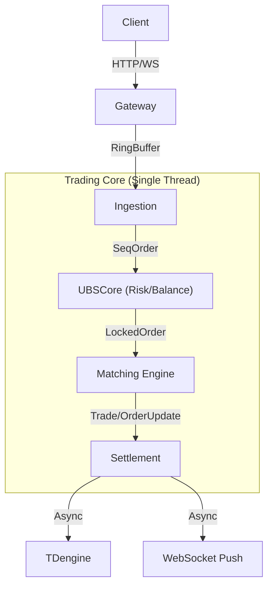

# AGENTS.md

> **Top-Level AI Agent Configuration for Zero X Infinity**
>
> This file is the primary entry point for all AI agents working on this codebase.

---

## 🎯 Project Overview

**Zero X Infinity** is a production-grade cryptocurrency matching engine achieving **1.3M orders/sec** on a single core.

| Aspect | Details |
|--------|---------|
| **Language** | Rust |
| **Architecture** | LMAX Disruptor-style Ring Buffer Pipeline |
| **Database** | PostgreSQL (config) + TDengine (trading data) |
| **API** | REST + WebSocket with Ed25519 authentication |
| **Current Phase** | 0x0C Trade Fee System (completed) |

---

## 📖 Essential Reading

Before making any changes, AI agents MUST read:

| Document | Purpose |
|----------|---------|
| [Project Roadmap](./docs/src/0x00-mvp-roadmap.md) | Current progress and planned phases |
| [API Conventions](./docs/standards/api-conventions.md) | REST API standards |
| [ID Specification](./docs/src/0x0A-b-id-specification.md) | Identity addressing rules |
| [Development Guidelines](./docs/standards/development-guidelines.md) | Coding standards |

---

## 🎭 AI Role System

This project uses a **Multi-Role AI Review System**. Each role has specific responsibilities and review focus areas.

### Available Roles

| Role | File | Primary Focus |
|------|------|---------------|
| 🏛️ Architect | [architect.md](./docs/agents/architect.md) | System design, scalability |
| 💻 Developer | [developer.md](./docs/agents/developer.md) | Code quality, implementation |
| 🧪 QA Engineer | [qa-engineer.md](./docs/agents/qa-engineer.md) | Testing, edge cases |
| 🔒 Security | [security-reviewer.md](./docs/agents/security-reviewer.md) | Vulnerabilities, threats |
| 🔧 DevOps | [devops-engineer.md](./docs/agents/devops-engineer.md) | Deployment, operations |

### How to Activate a Role

```
I am acting as the [ROLE NAME] as defined in AGENTS.md.
My primary focus is [FOCUS AREA].
I will review/implement with [ROLE]'s perspective.
```

---

## 🔄 Workflow: Specification Mode

**Principle**: Plan First, Code Later. Zero risk during planning phase.

See: [Specification Mode Workflow](./docs/agents/specification-mode.md)

### Quick Summary

```
┌─────────────────────────────────────────────────────────────────────┐
│ 1. User Request (4-6 sentences)                                    │
│ 2. Agent READ-ONLY Analysis (no code changes)                      │
│ 3. Generate Specification                                          │
│ 4. Multi-Role Review (Architect → Developer → QA → Security → DevOps) │
│ 5. User Approval                                                    │
│ 6. Controlled Execution (Low/Medium/High autonomy)                 │
└─────────────────────────────────────────────────────────────────────┘
```

---

## 🏗️ Architecture Quick Reference



---

## 📁 Key Directories

| Directory | Purpose |
|-----------|---------|
| `src/` | Rust source code |
| `src/gateway/` | HTTP API handlers |
| `src/persistence/` | TDengine queries |
| `src/pipeline/` | Ring Buffer implementation |
| `docs/` | mdBook documentation |
| `scripts/` | Build/test/deploy scripts |
| `config/` | YAML configuration files |
| `baseline/` | Golden test baselines |

---

## ⚠️ Critical Rules

### DO NOT

- ❌ Modify code during planning phase (Specification Mode)
- ❌ Use `f64` for financial calculations (use `u64` with 10^6 precision)
- ❌ Use `docker exec` in CI scripts (use REST API instead)
- ❌ Commit without running `cargo fmt` and `cargo clippy`
- ❌ Hardcode ports or credentials (use environment variables)

### MUST DO

- ✅ Read role definition before starting work
- ✅ Generate specification before implementation
- ✅ Run `./scripts/pre-commit.sh` before committing
- ✅ Source `scripts/lib/db_env.sh` in test scripts
- ✅ Follow [Pre-merge Checklist](./docs/src/standards/pre-merge-checklist.md)

---

## 🔗 Navigation

### Agent Configuration
- [AGENTS.md](./AGENTS.md) ← You are here
- [Specification Mode](./docs/agents/specification-mode.md)
- [Role: Architect](./docs/agents/architect.md)
- [Role: Developer](./docs/agents/developer.md)
- [Role: QA Engineer](./docs/agents/qa-engineer.md)
- [Role: Security Reviewer](./docs/agents/security-reviewer.md)
- [Role: DevOps Engineer](./docs/agents/devops-engineer.md)

### Project Standards
- [Development Guidelines](./docs/standards/development-guidelines.md)
- [API Conventions](./docs/standards/api-conventions.md)
- [CI Pitfalls](./docs/src/standards/ci-pitfalls.md)
- [Pre-merge Checklist](./docs/src/standards/pre-merge-checklist.md)

### Technical Documentation
- [Project Roadmap](./docs/src/0x00-mvp-roadmap.md)
- [Trade Fee System](./docs/src/0x0C-trade-fee.md)
- [ID Specification](./docs/src/0x0A-b-id-specification.md)
- [Database Selection](./docs/src/database-selection-tdengine.md)

---

*Last Updated: 2024-12-25*
