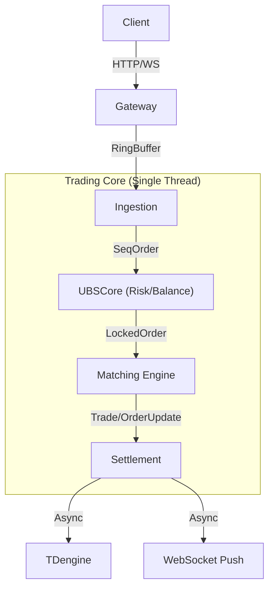

# AGENTS.md

> **Top-Level AI Agent Configuration for Zero X Infinity**
>
> This file is the primary entry point for all AI agents working on this codebase.

---

## 🎯 Project Overview

**Zero X Infinity** is a production-grade cryptocurrency matching engine achieving **1.3M orders/sec** on a single core.

| Aspect | Details |
|--------|---------|
| **Language** | Rust |
| **Architecture** | LMAX Disruptor-style Ring Buffer Pipeline |
| **Database** | PostgreSQL (config) + TDengine (trading data) |
| **API** | REST + WebSocket with Ed25519 authentication |
| **Current Phase** | 0x10 Web Frontend (In Progress) |

---

## 📖 Essential Reading
> [!IMPORTANT]
> **CRITICAL**: You MUST read [Testing Pitfalls](./docs/src/testing-pitfalls.md) BEFORE writing or running any test scripts. Violating the rules in this file (especially `pkill -f` and Stale Binary Trap) will cause severe system instability.

Before making any changes, AI agents MUST read:

| Document | Purpose |
|----------|---------|
| [Project Roadmap](./docs/src/0x00-mvp-roadmap.md) | Current progress and planned phases |
| [API Conventions](./docs/standards/api-conventions.md) | REST API standards |
| [ID Specification](./docs/src/0x0A-b-id-specification.md) | Identity addressing rules |
| [Development Guidelines](./docs/standards/development-guidelines.md) | Coding standards |
| [Testing Pitfalls](./docs/src/testing-pitfalls.md) | Common traps and best practices |
| [Money Type Safety](./docs/standards/money-type-safety.md) | **CRITICAL**: Balance & Scaling rules |

---

## 🧭 Core Principle: Stay on Track

> **AI agents easily lose direction during complex tasks. To prevent this, ALL work MUST follow the universal methodology below, plus role-specific techniques.**

---

### Universal Methodology (ALL Roles)

Every AI agent, regardless of role, follows this pattern:

```
┌─────────────────────────────────────────────────────────────────────┐
│               UNIVERSAL WORK METHODOLOGY                            │
├─────────────────────────────────────────────────────────────────────┤
│                                                                     │
│  PHASE 1: TOP VIEW (Before ANY work)                               │
│  ┌─────────────────────────────────────────────────────────────┐   │
│  │ • State the goal in ONE sentence                            │   │
│  │ • Define what "DONE" looks like                             │   │
│  │ • List acceptance criteria as checkboxes                    │   │
│  └─────────────────────────────────────────────────────────────┘   │
│                                                                     │
│  PHASE 2: ACCEPTANCE CHECKLIST (Before execution)                  │
│  ┌─────────────────────────────────────────────────────────────┐   │
│  │ - [ ] Criterion 1: [specific, measurable]                   │   │
│  │ - [ ] Criterion 2: [specific, measurable]                   │   │
│  │ - [ ] Criterion N: [specific, measurable]                   │   │
│  └─────────────────────────────────────────────────────────────┘   │
│                                                                     │
│  PHASE 3: EXECUTE (With continuous alignment)                      │
│  ┌─────────────────────────────────────────────────────────────┐   │
│  │ • Before each action: "Does this serve the goal?"           │   │
│  │ • After each step: Update checklist                         │   │
│  │ • If drifting: STOP → Re-read goal → Realign                │   │
│  └─────────────────────────────────────────────────────────────┘   │
│                                                                     │
│  PHASE 4: VERIFY (Before delivery)                                 │
│  ┌─────────────────────────────────────────────────────────────┐   │
│  │ • Check EVERY acceptance criterion: ✅ or ❌                 │   │
│  │ • If ❌: Fix or document exception                          │   │
│  │ • Compare result against original goal                      │   │
│  └─────────────────────────────────────────────────────────────┘   │
│                                                                     │
│  PHASE 5: DELIVER (Complete handover)                              │
│  ┌─────────────────────────────────────────────────────────────┐   │
│  │ • Delivery summary: What was done                           │   │
│  │ • Acceptance status: All criteria passed?                   │   │
│  │ • Handover notes: What next session needs to know           │   │
│  └─────────────────────────────────────────────────────────────┘   │
│                                                                     │
└─────────────────────────────────────────────────────────────────────┘
```

### Universal Checklist Template

```markdown
## Task: [Original Request]

### 🎯 Goal (ONE sentence)
[What success looks like]

### ✅ Acceptance Criteria (before starting)
- [ ] [Criterion 1]
- [ ] [Criterion 2]
- [ ] [Criterion 3]

### 📋 Progress Tracking (during execution)
- [x] Completed step
- [ ] Current step ← 
- [ ] Pending step

### ❌ Out of Scope
- [Explicitly excluded]

### 📦 Delivery Summary (after completion)
- **Status**: [All criteria met / Partial / Blocked]
- **Result**: [What was delivered]
- **Handover**: [What next session needs to know]
```

---

### Role-Specific Techniques

Each role adds **specialized techniques** on top of the universal methodology:

| Role | Technique | Artifact Created |
|------|-----------|------------------|
| 🏛️ Architect | **ADR-First** | Architecture Decision Record |
| 💻 Developer | **TDD-First** | Failing test before code |
| 🧪 QA | **Test Plan-First** | Test case matrix |
| 🔒 Security | **Threat Model-First** | STRIDE threat analysis |
| 🔧 DevOps | **Runbook-First** | Deployment runbook |

> **See each role's definition file for detailed techniques** → [Role Files](#available-roles)

---

### Task Complexity Guide

| Complexity | Acceptance Criteria | Role Technique |
|------------|---------------------|----------------|
| **Simple** (<30 min) | 1-2 criteria | Optional |
| **Medium** (1-2 hrs) | 3-5 criteria | **Required** |
| **Complex** (>2 hrs) | 5+ criteria + Review | **Mandatory** |

---

## 🎭 AI Role System

This project uses a **Multi-Role AI Review System**. Each role has specific responsibilities and review focus areas.

### Available Roles

| Role | File | Primary Focus |
|------|------|---------------|
| 🏛️ Architect | [architect.md](./docs/agents/architect.md) | System design, scalability |
| 💻 Developer | [developer.md](./docs/agents/developer.md) | Code quality, implementation |
| 🧪 QA Engineer | [qa-engineer.md](./docs/agents/qa-engineer.md) | Testing, edge cases |
| 🔒 Security | [security-reviewer.md](./docs/agents/security-reviewer.md) | Vulnerabilities, threats |
| 🔧 DevOps | [devops-engineer.md](./docs/agents/devops-engineer.md) | Deployment, operations |

### How to Activate a Role

```
I am acting as the [ROLE NAME] as defined in AGENTS.md.
My primary focus is [FOCUS AREA].
I will review/implement with [ROLE]'s perspective.
```

### Session Working Directories

Each role maintains its own working documents for handover and parallel work:

```
docs/agents/sessions/
├── shared/             # 🔗 Cross-role coordination
│   ├── decisions.md    # Shared decisions log
│   └── blockers.md     # Active blockers
├── architect/          # 🏛️ Architect's current task
├── developer/          # 💻 Developer's current task
├── qa/                 # 🧪 QA's current task
├── security/           # 🔒 Security's current task
└── devops/             # 🔧 DevOps's current task
```

See: [Sessions README](./docs/agents/sessions/README.md)

---

## 🔄 Workflow: Specification Mode

**Principle**: Plan First, Code Later. Zero risk during planning phase.

See: [Specification Mode Workflow](./docs/agents/specification-mode.md)

### Quick Summary

```
┌─────────────────────────────────────────────────────────────────────┐
│ 1. User Request (4-6 sentences)                                    │
│ 2. Agent READ-ONLY Analysis (no code changes)                      │
│ 3. Generate Specification                                          │
│ 4. Multi-Role Review (Architect → Developer → QA → Security → DevOps) │
│ 5. User Approval                                                    │
│ 6. Controlled Execution (Low/Medium/High autonomy)                 │
└─────────────────────────────────────────────────────────────────────┘
```

---

## 🏗️ Architecture Quick Reference



---

## 📁 Key Directories

| Directory | Purpose |
|-----------|---------|
| `src/` | Rust source code |
| `src/gateway/` | HTTP API handlers |
| `src/persistence/` | TDengine queries |
| `src/pipeline/` | Ring Buffer implementation |
| `docs/` | mdBook documentation |
| `scripts/` | Build/test/deploy scripts |
| `config/` | YAML configuration files |
| `baseline/` | Golden test baselines |

---

## ⚠️ Critical Rules

### DO NOT

- ❌ Use `pkill -f "zero_x_infinity"` (**CRITICAL**: Causes IDE crash! See [Testing Pitfalls](./docs/src/testing-pitfalls.md))
- ❌ Modify code during planning phase (Specification Mode)
- ❌ Use `f64` or `f32` for ANY financial calculations (Zero Tolerance).
- ❌ Use `Decimal` types in Core Business Logic or Database Storage (unless DB strictly requires Decimal). Start with `u64` Fixed-Point everywhere.
- **Exception**: `Decimal` is permitted *only* at the **API Boundary** (converting Client requests to Internal Fixed-Point).
- ❌ Trust "Implicit Scaling" - ALWAYS verify the scaling factor (10^8 for BTC, 10^6 for USDT) against `assets_tb`.
- ❌ Use `docker exec` in CI scripts (use REST API instead)
- ❌ Commit without running `cargo fmt` and `cargo clippy`
- ❌ Hardcode ports or credentials (use environment variables)
- ❌ **Switch Roles AUTONOMOUSLY**: You are FORBIDDEN from switching roles (e.g., Architect -> Developer) without explicit user approval. Architect stops at Handover.
- ❌ **Manual Money Scaling**: You are FORBIDDEN from performing manual scaling (e.g., `amount * 10^8`) outside of `src/money.rs`. ALWAYS use `SymbolManager` intent-based methods or the `ScaledAmount` type. No exceptions.

### MUST DO

- ✅ Read role definition before starting work
- ✅ Generate specification before implementation
- ✅ Run `./scripts/pre-commit.sh` before committing
- ✅ Source `scripts/lib/db_env.sh` in test scripts
- ✅ Follow [Pre-merge Checklist](./docs/src/standards/pre-merge-checklist.md)
- ✅ **Review [Testing Pitfalls](./docs/src/testing-pitfalls.md) before running E2E tests**

---

## 🔗 Navigation

### Agent Configuration
- [AGENTS.md](./AGENTS.md) ← You are here
- [Specification Mode](./docs/agents/specification-mode.md)
- [Role: Architect](./docs/agents/architect.md)
- [Role: Developer](./docs/agents/developer.md)
- [Role: QA Engineer](./docs/agents/qa-engineer.md)
- [Role: Security Reviewer](./docs/agents/security-reviewer.md)
- [Role: DevOps Engineer](./docs/agents/devops-engineer.md)

### Collaboration Workflows
- [Architect → Developer Handover](./docs/agents/workflows/arch-to-dev-handover.md)
- [Architect → QA Handover](./docs/agents/workflows/arch-to-qa-handover.md)
- [Developer → QA Handover](./docs/agents/workflows/dev-to-qa-handover.md)
- [Sessions README](./docs/agents/sessions/README.md)

### Project Standards
- [Development Guidelines](./docs/standards/development-guidelines.md)
- [API Conventions](./docs/standards/api-conventions.md)
- [CI Pitfalls](./docs/src/standards/ci-pitfalls.md)
- [Testing Pitfalls](./docs/src/testing-pitfalls.md)
- [Pre-merge Checklist](./docs/src/standards/pre-merge-checklist.md)

### Technical Documentation
- [Project Roadmap](./docs/src/0x00-mvp-roadmap.md)
- [Trade Fee System](./docs/src/0x0C-trade-fee.md)
- [ID Specification](./docs/src/0x0A-b-id-specification.md)
- [Database Selection](./docs/src/database-selection-tdengine.md)

---

*Last Updated: 2024-12-25*
