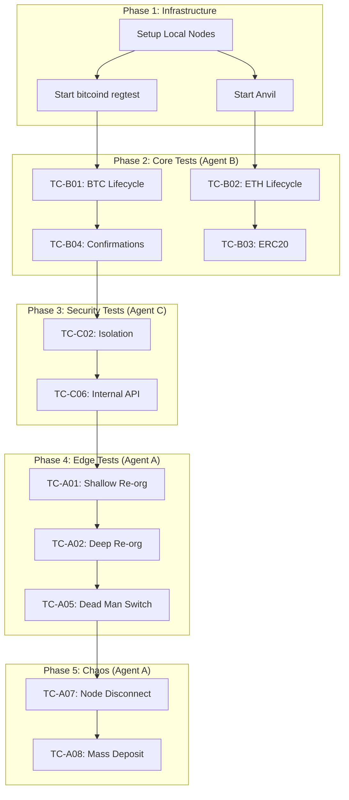

# Phase 0x11-a: Real Chain Integration - Multi-Persona QA Test Plan

| Phase | 0x11-a Real Chain Integration |
| :--- | :--- |
| **Date** | 2025-12-28 |
| **Status** | 📋 **TEST PLAN DESIGN** |
| **Methodology** | Multi-Persona QA Team |

---

## 🎭 QA Team Organization

| Agent | Role | Focus Area | Chinese |
| :--- | :--- | :--- | :--- |
| **Agent A** | 激进派 QA | Edge Cases, Chaos Testing, Boundary Conditions | 专门通过边缘测试找漏洞 |
| **Agent B** | 保守派 QA | Core Flow Stability, Happy Path, Regression | 关注核心流程的稳定性和回归测试 |
| **Agent C** | 安全专家 QA | Permissions, Data Leakage, Access Control | 关注权限、数据泄露等安全问题 |
| **Leader** | 主编 | Aggregation, Coordination, External Interface | 负责汇总、整理、润色，唯一对外接口人 |

---

## 📁 Test Directory Structure

```
scripts/tests/
├── 0x11_funding/           # Existing: Mock deposit/withdraw
├── 0x12_integration/       # Existing: Trading integration
└── 0x11a_real_chain/       # NEW: Real Chain Integration Tests
    ├── common/
    │   ├── __init__.py
    │   ├── chain_utils.py      # BTC/ETH RPC helpers
    │   └── test_fixtures.py    # Common test data
    ├── agent_a_edge/           # 激进派: Edge cases
    │   ├── test_reorg_shallow.py
    │   ├── test_reorg_deep.py
    │   ├── test_dust_attack.py
    │   └── test_precision_overflow.py
    ├── agent_b_core/           # 保守派: Core flow
    │   ├── test_deposit_lifecycle.py
    │   ├── test_confirmation_state.py
    │   └── test_sentinel_stability.py
    ├── agent_c_security/       # 安全专家: Security
    │   ├── test_address_poisoning.py
    │   ├── test_rpc_injection.py
    │   └── test_cursor_manipulation.py
    └── run_all_0x11a.sh        # Master runner
```

---

# 🔴 Agent A (激进派): Edge Case Testing

> **Mission**: 破坏系统！找到所有能让系统崩溃或产生错误结果的边界条件。

## A.1 Re-org Attack Scenarios

### TC-A01: Shallow Re-org Detection
**Objective**: Verify Sentinel correctly detects and handles shallow re-org (< MAX_REORG_DEPTH).

| Step | Action | Expected |
| :--- | :--- | :--- |
| 1 | Mine block N with deposit TX | Deposit status = `CONFIRMING` |
| 2 | Wait for 3 confirmations | Status = `CONFIRMING (3/6)` |
| 3 | `bitcoin-cli invalidateblock <hash_N>` | Sentinel detects hash mismatch |
| 4 | Mine alternative block N' (no deposit) | Deposit status = `ORPHANED` |
| 5 | Verify user balance | Balance = 0 (not credited) |

### TC-A02: Deep Re-org (51% Attack Simulation)
**Objective**: Verify Circuit Breaker triggers on deep re-org after finalization.

| Step | Action | Expected |
| :--- | :--- | :--- |
| 1 | Deposit 10 BTC, wait for 6 confirmations | Status = `SUCCESS`, Balance credited |
| 2 | Manually truncate chain by 10 blocks | Sentinel detects `depth > MAX_REORG_DEPTH` |
| 3 | Verify system response | **Circuit Breaker**: Withdrawals FROZEN |
| 4 | Check logs | P0 Alert generated |

### TC-A03: Simultaneous Re-org on Multiple Chains
**Objective**: Verify isolation between BTC and ETH chain cursors.

| Step | Action | Expected |
| :--- | :--- | :--- |
| 1 | Trigger re-org on BTC | BTC cursor rolled back |
| 2 | Verify ETH cursor | ETH cursor unchanged |

## A.2 Boundary Condition Tests

### TC-A04: Minimum Deposit Threshold (Dust Wall)
**Objective**: Verify deposits below `MIN_DEPOSIT_THRESHOLD` are rejected.

```python
# Test Case: Dust Deposit
def test_dust_deposit_rejected():
    # Config: MIN_DEPOSIT_THRESHOLD = 0.001 BTC
    send_btc(amount=0.0001)  # Below threshold
    wait_for_block(1)
    assert get_deposit_status() == "IGNORED" or balance == 0
```

### TC-A05: Maximum Block Lag (Dead Man Switch)
**Objective**: Verify Sentinel halts when node is stale.

| Step | Action | Expected |
| :--- | :--- | :--- |
| 1 | Stop local bitcoind | Node stops producing blocks |
| 2 | Wait for `MAX_BLOCK_LAG_SECONDS` + buffer | Sentinel enters `STALE_NODE` state |
| 3 | Attempt new deposit | Deposit NOT processed |
| 4 | Verify alert | P0 Alert: "Node Lag Detected" |

### TC-A06: Precision Overflow (Wei/Satoshi Edge)
**Objective**: Verify truncation protocol handles extreme values.

```python
# Test Cases:
test_cases = [
    ("Max u64", 18446744073709551615),  # u64::MAX
    ("Max BTC", 21_000_000 * 10**8),    # 21M BTC in satoshi
    ("Tiny ETH", 1),                     # 1 wei
    ("Dust ETH", 10**6 - 1),             # Just below min precision
]
```

## A.3 Chaos Engineering

### TC-A07: Node Disconnect During Scan
**Objective**: Verify graceful recovery when RPC disconnects mid-scan.

| Step | Action | Expected |
| :--- | :--- | :--- |
| 1 | Start block scan | Sentinel processing |
| 2 | Kill bitcoind process during scan | Sentinel logs RPC error |
| 3 | Restart bitcoind | Sentinel resumes from last cursor |
| 4 | Verify no duplicate processing | Each block processed exactly once |

### TC-A08: Concurrent Deposit Flood
**Objective**: Verify system handles 1000 deposits in single block.

```python
async def test_mass_deposit():
    # Generate 1000 unique addresses
    addresses = [generate_address() for _ in range(1000)]
    
    # Send deposits to all
    for addr in addresses:
        send_btc(addr, 0.01)
    
    mine_block()
    
    # Verify all detected
    assert len(get_detected_deposits()) == 1000
```

---

# 🟢 Agent B (保守派): Core Flow Testing

> **Mission**: 确保核心流程稳定、可预测、无回归。

## B.1 Deposit Lifecycle (Happy Path)

### TC-B01: BTC Deposit Full Lifecycle
**Objective**: Verify complete deposit flow from detection to finalization.

| Step | Action | Expected |
| :--- | :--- | :--- |
| 1 | User requests deposit address | Returns valid `bc1...` address |
| 2 | Send 1.0 BTC to address | TX in mempool |
| 3 | Mine 1 block | Status: `DETECTED (0 conf)` → `CONFIRMING (1/6)` |
| 4 | Mine 5 more blocks | Status: `CONFIRMING (6/6)` → `SUCCESS` |
| 5 | Query user balance (Funding Wallet) | Balance = 1.0 BTC |
| 6 | Query deposit history | Record with `tx_hash`, `block_height`, `confirmations=6` |

### TC-B02: ETH Deposit Full Lifecycle
**Objective**: Verify EVM chain deposit flow.

| Step | Action | Expected |
| :--- | :--- | :--- |
| 1 | User requests ETH deposit address | Returns valid `0x...` (42 chars) |
| 2 | Send 10.0 ETH via `cast send` | TX mined |
| 3 | Wait for `REQUIRED_CONFIRMATIONS` | Status: `SUCCESS` |
| 4 | Query balance | Balance = 10.0 ETH |

### TC-B03: ERC20 Token Deposit
**Objective**: Verify Transfer event log parsing.

```python
def test_erc20_deposit():
    # Deploy mock USDT
    usdt = deploy_erc20("USDT", 6)
    
    # Transfer to user deposit address
    usdt.transfer(user_addr, 1000 * 10**6)
    
    # Verify detection via logs
    assert get_deposit_status(user_addr, "USDT") == "SUCCESS"
```

## B.2 Confirmation State Machine

### TC-B04: Confirmation Count Accuracy
**Objective**: Verify confirmation count increments correctly.

```python
def test_confirmation_increment():
    send_deposit()
    mine_block()
    
    for expected_conf in range(1, 7):
        assert get_confirmations() == expected_conf
        mine_block()
```

### TC-B05: State Transition Validation
**Objective**: Verify illegal state transitions are blocked.

| From State | To State | Valid? |
| :--- | :--- | :--- |
| `DETECTED` | `CONFIRMING` | ✅ |
| `CONFIRMING` | `SUCCESS` | ✅ |
| `SUCCESS` | `DETECTED` | ❌ |
| `ORPHANED` | `SUCCESS` | ❌ |

## B.3 Sentinel Stability

### TC-B06: Cursor Persistence Across Restart
**Objective**: Verify Sentinel resumes from correct height after restart.

| Step | Action | Expected |
| :--- | :--- | :--- |
| 1 | Sentinel scans to block 100 | `chain_cursor.last_scanned_height = 100` |
| 2 | Stop Sentinel | Graceful shutdown |
| 3 | Mine 5 blocks | Chain height = 105 |
| 4 | Restart Sentinel | Resumes from block 101 |
| 5 | Verify no gaps | All blocks 101-105 scanned |

### TC-B07: Idempotent Processing
**Objective**: Verify duplicate block processing is safe.

```python
def test_idempotent_scan():
    initial_balance = get_balance()
    
    # Force re-scan of already processed block
    reset_cursor_to(block=100)
    trigger_scan()
    
    # Balance should not change
    assert get_balance() == initial_balance
```

---

# 🔒 Agent C (安全专家): Security Testing

> **Mission**: 寻找权限漏洞、数据泄露、注入攻击向量。

## C.1 Address Management Security

### TC-C01: Address Poisoning Attack
**Objective**: Verify rate limiting prevents address generation abuse.

```python
def test_address_poisoning():
    # Attack: Generate millions of addresses to bloat filter
    for i in range(10000):
        try:
            generate_address()
        except RateLimitError:
            assert i < 100  # Should be blocked before 100
            return
    
    pytest.fail("Rate limiting not enforced!")
```

### TC-C02: Address Isolation (Cross-User)
**Objective**: Verify User A cannot access User B's deposit address.

| Step | Action | Expected |
| :--- | :--- | :--- |
| 1 | User A generates BTC address | Returns `addr_A` |
| 2 | User B generates BTC address | Returns `addr_B` (different) |
| 3 | User A queries with `user_id=B` param | Returns `addr_A` (not `addr_B`) |
| 4 | Deposit to `addr_B` | Credits User B only |

## C.2 RPC Security

### TC-C03: Fake Block Injection
**Objective**: Verify Sentinel validates block integrity.

```python
def test_fake_block_rejection():
    # Attack: Send crafted block with fake deposit
    fake_block = create_fake_block(
        deposits=[{"user": "admin", "amount": 1000000}]
    )
    
    # Inject via compromised RPC (simulated)
    inject_to_rpc(fake_block)
    
    # Verify multi-source validation
    assert get_balance("admin") == 0  # Not credited
```

### TC-C04: SQL Injection in Chain Cursor
**Objective**: Verify chain metadata is sanitized.

```python
def test_cursor_sql_injection():
    # Attack: Malicious block hash
    malicious_hash = "'; DROP TABLE chain_cursor; --"
    
    # This should be rejected or escaped
    response = update_cursor(hash=malicious_hash)
    
    assert "error" in response or cursor_table_exists()
```

## C.3 Data Leakage

### TC-C05: Deposit History Privacy
**Objective**: Verify users cannot view others' deposit history.

| Step | Action | Expected |
| :--- | :--- | :--- |
| 1 | User A deposits 10 BTC | Record created |
| 2 | User B queries deposit history | Returns only User B's records |
| 3 | User B queries with `user_id=A` param | Returns User B's records (param ignored) |

### TC-C06: Internal Endpoint Protection
**Objective**: Verify Sentinel internal APIs are not exposed.

```python
def test_internal_endpoint_blocked():
    # Attack: External user tries to call internal Sentinel API
    endpoints = [
        "/internal/sentinel/force_scan",
        "/internal/sentinel/reset_cursor",
        "/internal/sentinel/inject_deposit",
    ]
    
    for ep in endpoints:
        resp = requests.post(ep)
        assert resp.status_code in [401, 403, 404]
```

## C.4 Cryptographic Validation

### TC-C07: XPUB Key Rotation
**Objective**: Verify old addresses remain valid after key rotation.

| Step | Action | Expected |
| :--- | :--- | :--- |
| 1 | Generate address with XPUB v1 | `addr_v1` |
| 2 | Rotate to XPUB v2 | New config active |
| 3 | Deposit to `addr_v1` | Still detected and credited |
| 4 | Generate new address | Uses XPUB v2 |

---

# 📊 Agent Leader (主编): Consolidated Test Matrix

> **Mission**: 汇总所有测试用例，确保覆盖率完整，协调各 Agent 工作。

## Test Coverage Summary

> **Note**: Includes 6 additional test cases from [Cross-Review](./0x11-a-cross-review.md) (2025-12-28)

| Component | Agent A (Edge) | Agent B (Core) | Agent C (Security) | Total |
| :--- | :---: | :---: | :---: | :---: |
| **Sentinel Service** | 5 | 4 | 2 | 11 |
| **Deposit Lifecycle** | 2 | 4 | 2 | 8 |
| **Re-org Handling** | 4 | 1 | 1 | 6 |
| **Address Management** | 1 | 1 | 3 | 5 |
| **Chain Cursor** | 2 | 2 | 1 | 5 |
| **Precision/Overflow** | 2 | 1 | 0 | 3 |
| **Security Audit** | 0 | 0 | 1 | 1 |
| **Total** | **16** | **13** | **10** | **39** |

### Cross-Review Additions (2025-12-28)

| ID | Test Case | Owner | Source |
| :--- | :--- | :--- | :--- |
| TC-B08 | Concurrent Multi-User Deposits | Agent B | A → B |
| TC-A09 | Post-Chaos Health Check | Agent A | B → A |
| TC-C08 | Double-Spend Detection | Agent C | A → C |
| TC-C09 | Security Audit Logging | Agent C | B → C |
| TC-A10 | Alert Verification (Circuit Breaker) | Agent A | C → A |
| TC-B09 | Pre-Confirmation Withdrawal Block | Agent B | C → B |

## Priority Classification

### P0 (Must Pass for Release)
| ID | Test Case | Owner |
| :--- | :--- | :--- |
| TC-B01 | BTC Deposit Full Lifecycle | Agent B |
| TC-B02 | ETH Deposit Full Lifecycle | Agent B |
| TC-A01 | Shallow Re-org Detection | Agent A |
| TC-A02 | Deep Re-org Circuit Breaker | Agent A |
| TC-C02 | Address Isolation | Agent C |
| TC-B06 | Cursor Persistence | Agent B |

### P1 (Should Pass)
| ID | Test Case | Owner |
| :--- | :--- | :--- |
| TC-B03 | ERC20 Token Deposit | Agent B |
| TC-B04 | Confirmation Count Accuracy | Agent B |
| TC-A05 | Dead Man Switch | Agent A |
| TC-C01 | Address Poisoning Prevention | Agent C |
| TC-C06 | Internal Endpoint Protection | Agent C |

### P2 (Nice to Have)
| ID | Test Case | Owner |
| :--- | :--- | :--- |
| TC-A03 | Multi-Chain Re-org Isolation | Agent A |
| TC-A08 | Mass Deposit Flood | Agent A |
| TC-C03 | Fake Block Injection | Agent C |

## Execution Order



## Verification Artifacts

| Artifact | Path | Purpose |
| :--- | :--- | :--- |
| Test Plan | `docs/agents/sessions/qa/0x11-a-multi-persona-test-plan.md` | This document |
| Test Scripts | `scripts/tests/0x11a_real_chain/` | Executable tests |
| Results Report | `docs/src/qa/0x11a_real_chain/test_report.md` | Execution results |
| Defect Log | `docs/src/qa/0x11a_real_chain/defects.md` | Found issues |

---

## Handover Checklist (Leader to Arch)

- [ ] All P0 tests pass
- [ ] All P1 tests pass (or documented exceptions)
- [ ] No Critical/High security vulnerabilities
- [ ] Reconciliation equation verified
- [ ] CI integration complete

---

*Generated by QA Team (Multi-Persona) - 2025-12-28*
