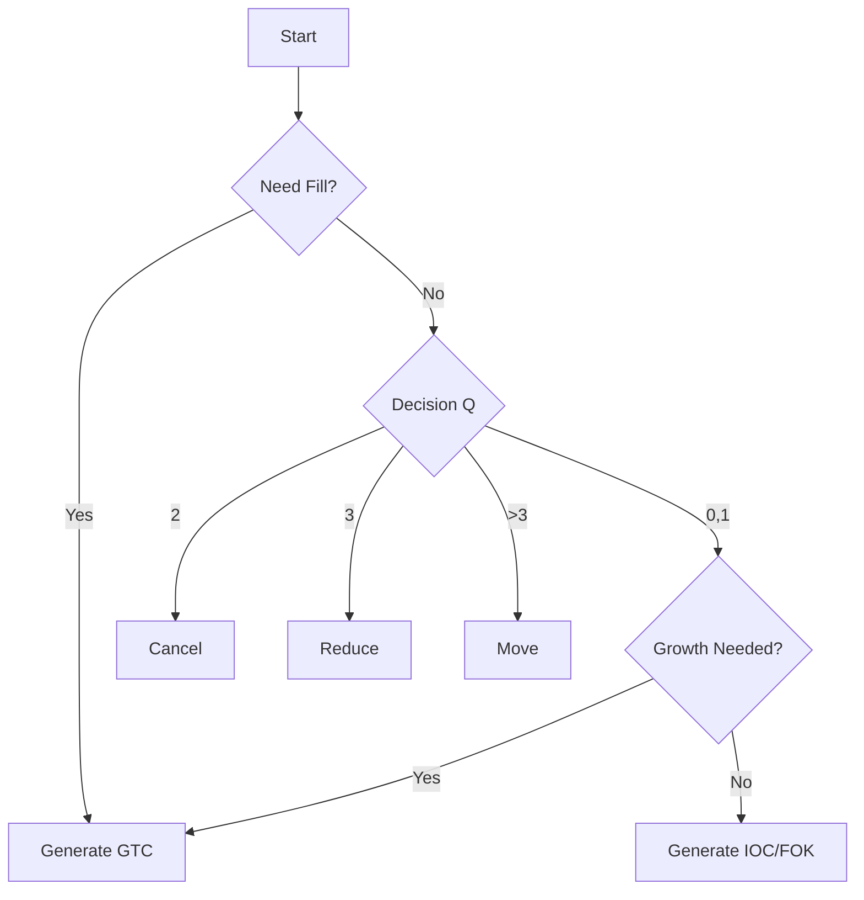

# Exchange-Core Rust Porting Test Specification Package

**版本**: 1.0.0
**日期**: 2025-12-30
**适用对象**: 研发工程师, QA 工程师

---

## 📑 交付清单 (Delivery Checklist)

- [ ] **1. 测试数据生成规范** (核心)
    - [ ] 伪随机数生成器 (LCG) 实现标准
    - [ ] 随机种子 (Seed) 派生算法
    - [ ] Pareto 分布参数 (scale=0.001, shape=1.5)
    - [ ] 5 套标准数据集配置 (SinglePair -> Huge)
- [ ] **2. 业务逻辑复现规范**
    - [ ] 订单属性生成算法 (价格、数量、类型)
    - [ ] 撮合后状态更新逻辑
    - [ ] 命令分布比例校验
- [ ] **3. 执行与验证规范**
    - [ ] 7 步标准测试流程
    - [ ] 性能指标采集标准 (MT/s, Latency Percentiles)
    - [ ] 硬件环境基准要求

---

## 1. 测试数据生成规范 (Data Generation Spec)

### 1.1 伪随机数生成器 (PRNG)
**必须**实现 Java `java.util.Random` 的线性同余生成器 (LCG) 算法，以保证数据序列完全一致。

*   **状态更新公式**: `seed = (seed * 0x5DEECE66D + 0xB) & ((1 << 48) - 1)`
*   **Next Int**: `(int)(seed >>> (48 - bits))`
*   **Next Double**: `(((long)(next(26)) << 27) + next(27)) / (double)(1L << 53)`

### 1.2 随机种子派生 (Seed Derivation)
每个测试 Session 的种子由 `TestOrdersGeneratorSession.java` 定义：
```text
Input: symbol_id (int), benchmark_seed (long)

Hash = 1
Hash = 31 * Hash + (symbol_id * -177277)
Hash = 31 * Hash + (benchmark_seed * 10037 + 198267)

Session_Seed = Hash
```

### 1.3 关键分布参数
*   **交易对权重**: `ParetoDistribution(scale=0.001, shape=1.5)`
*   **用户账户数**: `ParetoDistribution(scale=1.0, shape=1.5)`
*   **订单数量**: `1 + rand(6) * rand(6) * rand(6)` (范围 1-216, 极度偏向小单)
*   **价格波动**: `CENTRAL_MOVE_ALPHA = 0.01` (价格回归中心系数)

---

## 2. 标准数据集定义 (Standard Datasets)

| 数据集 | 用户数 | 订单簿深度 | 交易次数 | 交易对 | 说明 |
|:---|---:|---:|---:|---:|:---|
| **SinglePairMargin** | 2,000 | 1,000 | 3M | 1 | 基础功能验证 |
| **SinglePairExchange** | 2,000 | 1,000 | 3M | 1 | 现货撮合验证 |
| **Medium** | 3.3M | 1M | 3M | 10k | 内存容量验证 |
| **Large** | 10M | 3M | 3M | 50k | 生产级规模 |
| **Huge** | 33M | 30M | 10M | 100k | 极限压力测试 |

**货币定义**:
- `USD (840)`, `EUR (978)`, `XBT (3762)`, `ETH (3928)`, `LTC (4141)`

---

## 3. 业务逻辑复现 (Logic Reproduction)

### 3.1 命令生成流程
1.  **Fill Phase (预填充)**: 持续生成 `GTC` 订单，直到 Ask/Bid 深度均达到 `target_orders / 2`。
2.  **Benchmark Phase (压测)**: 按照以下逻辑生成混合指令：



### 3.2 关键比率校验
*   **IOC vs FOK_BUDGET**: 31 : 1 (在生成即时单时)
*   **GTC vs IOC**: 动态平衡，基准测试时约为 45% : 35%

### 3.3 BENCHMARK 阶段生成机制：影子订单簿

> **重要**: BENCHMARK 阶段的 Cancel/Move/Reduce 命令依赖于**之前生成的 GTC 订单状态**。

Java 代码在 `TestOrdersGeneratorSession` 中维护一个"影子订单簿"来跟踪状态：

```java
// 状态跟踪 Map
LongLongHashMap orderPrices;  // orderId → price
LongLongHashMap orderSizes;   // orderId → size
LongIntHashMap orderUids;     // orderId → uid

// 订单簿深度统计
int askOrdersNum, bidOrdersNum;
```

**生成流程**:
```
新 GTC 订单 → 记录到 orderPrices/orderSizes/orderUids
Cancel 命令 → 随机选择现有 orderId，从 Map 中删除
Move 命令 → 随机选择 orderId，生成新价格，更新 Map
Reduce 命令 → 随机选择 orderId，减少 size
IOC 成交 → 模拟匹配，更新/删除对手方订单
```

### 3.4 影子订单簿实现规范 (完整复现)

为了生成 Medium/Large/Huge 规模的测试数据，Rust 需要完整实现影子订单簿。

#### 3.4.1 核心数据结构

```rust
struct ShadowOrderBook {
    // 订单属性 Map
    order_prices: HashMap<i64, i64>,    // orderId → price
    order_sizes: HashMap<i64, i64>,     // orderId → size (剩余数量)
    order_uids: HashMap<i64, i32>,      // orderId → uid
    order_actions: HashMap<i64, bool>,  // orderId → is_ask (true=Ask, false=Bid)
    
    // 活跃订单列表 (用于随机选择)
    ask_orders: Vec<i64>,  // Ask 侧活跃订单 ID
    bid_orders: Vec<i64>,  // Bid 侧活跃订单 ID
    
    // 价格追踪
    last_trade_price: i64,
    best_ask: i64,
    best_bid: i64,
}
```

#### 3.4.2 状态更新规则

**A. 新 GTC 订单**:
```rust
fn on_new_gtc(&mut self, order_id: i64, price: i64, size: i64, uid: i32, is_ask: bool) {
    self.order_prices.insert(order_id, price);
    self.order_sizes.insert(order_id, size);
    self.order_uids.insert(order_id, uid);
    self.order_actions.insert(order_id, is_ask);
    if is_ask { self.ask_orders.push(order_id); }
    else { self.bid_orders.push(order_id); }
}
```

**B. Cancel 命令** (随机选择现有订单):
```rust
fn generate_cancel(&mut self, rng: &mut JavaRandom) -> Option<OrderCommand> {
    let orders = if rng.next_int(2) == 0 { &mut self.ask_orders } else { &mut self.bid_orders };
    if orders.is_empty() { return None; }
    let idx = rng.next_int(orders.len() as i32) as usize;
    let order_id = orders.swap_remove(idx);  // O(1) 删除
    self.order_prices.remove(&order_id);
    self.order_sizes.remove(&order_id);
    Some(OrderCommand::Cancel { order_id, uid: self.order_uids.remove(&order_id).unwrap() })
}
```

**C. Move 命令** (随机选择并更新价格):
```rust
fn generate_move(&mut self, rng: &mut JavaRandom) -> Option<OrderCommand> {
    let is_ask = rng.next_int(2) == 0;
    let orders = if is_ask { &self.ask_orders } else { &self.bid_orders };
    if orders.is_empty() { return None; }
    let order_id = orders[rng.next_int(orders.len() as i32) as usize];
    let old_price = self.order_prices[&order_id];
    let new_price = generate_new_price(rng, old_price, is_ask);  // 生成新价格
    self.order_prices.insert(order_id, new_price);
    Some(OrderCommand::Move { order_id, new_price })
}
```

**D. Reduce 命令** (随机减少数量):
```rust
fn generate_reduce(&mut self, rng: &mut JavaRandom) -> Option<OrderCommand> {
    // 类似 Cancel，但只减少 size 而非删除
    let reduce_by = 1 + rng.next_int(current_size as i32 - 1);
    self.order_sizes.insert(order_id, current_size - reduce_by as i64);
    Some(OrderCommand::Reduce { order_id, reduce_by })
}
```

**E. IOC 成交模拟**:
```rust
fn simulate_ioc_match(&mut self, ioc_cmd: &OrderCommand) {
    // 简化模拟：假设 IOC 完全成交，消耗对手方最优价格订单
    let opposite_orders = if ioc_cmd.is_ask { &mut self.bid_orders } else { &mut self.ask_orders };
    let mut remaining = ioc_cmd.size;
    while remaining > 0 && !opposite_orders.is_empty() {
        let matched_id = opposite_orders[0];
        let matched_size = self.order_sizes[&matched_id];
        if matched_size <= remaining {
            remaining -= matched_size;
            opposite_orders.remove(0);
            self.order_sizes.remove(&matched_id);
        } else {
            self.order_sizes.insert(matched_id, matched_size - remaining);
            remaining = 0;
        }
    }
    self.last_trade_price = ioc_cmd.price;
}
```

#### 3.4.3 命令生成决策树

```rust
fn generate_next_command(&mut self, rng: &mut JavaRandom) -> OrderCommand {
    let need_fill = self.ask_orders.len() < target_half || self.bid_orders.len() < target_half;
    
    if need_fill {
        return self.generate_gtc(rng);
    }
    
    let q = rng.next_int(8);  // 0-7
    match q {
        0 | 1 => {
            if self.need_growth() { self.generate_gtc(rng) }
            else { self.generate_ioc(rng) }
        }
        2 => self.generate_cancel(rng).unwrap_or_else(|| self.generate_gtc(rng)),
        3 => self.generate_reduce(rng).unwrap_or_else(|| self.generate_gtc(rng)),
        _ => self.generate_move(rng).unwrap_or_else(|| self.generate_gtc(rng)),
    }
}
```

> **验证方法**: 使用 `golden_single_pair_*.csv` 前 100-200 条命令验证影子订单簿实现的正确性，然后再扩展到大规模生成。


## 4. 指标采集标准 (Metrics Standard)

### 4.1 吞吐量 (Thoughput)
*   **单位**: MT/s (Million Transactions per Second)
*   **公式**: `Total_Commands / Duration_Seconds / 1,000,000`
*   **采样**: 记录每次迭代的速率，最终计算 Average。

### 4.2 延迟 (Latency)
*   **采集点**: 提交命令时间 vs 收到结果回调时间
*   **工具**: 推荐 `HdrHistogram` (2 significant digits)
*   **报告点**:
    *   `50.0%` (Median)
    *   `90.0%`
    *   `99.0%`
    *   `99.9%`
    *   `99.99%`
    *   `Worst` (Max)

---

## 5. 硬件与环境基准 (Environment Baseline)

> **注意**: 原项目是在 2010 年代硬件上测试的。现代硬件应当有显著提升。

*   **Reference CPU**: Intel Xeon X5690 (3.47GHz)
*   **关键设置**: 
    *   `Isolate CPUs` (隔离核心给撮合引擎)
    *   `Tickless Kernel`
    *   `Disable Spectre/Meltdown` Patches
    *   `HugePages` Enabled
*   **内存要求**: Huge 数据集至少需要 **64GB+** RAM。

---

---

## 6. Golden Data Verification (黄金数据验证)

为了确保 Rust 实现的随机生成逻辑与 Java 版本完全一致，已预先生成了一组"黄金数据"供逐字节核对。

### 6.1 数据文件

位于 `docs/exchange_core_verification_kit/golden_data/` 目录下：

**核心订单数据**:
1.  **`golden_single_pair_margin.csv`** (1100 records): 期货模式测试样本
2.  **`golden_single_pair_exchange.csv`** (1100 records): 现货模式测试样本
    - **格式**: `phase,command,order_id,symbol,price,size,action,order_type,uid`
    - *Seed = 1*

**UID 生成验证数据** (新增):
3.  **`*_users2currencies.csv`**: 用户-货币映射表
    - **格式**: `uid,currencies` (currencies 以分号分隔，如 `840;978`)
    - 用于验证 `UserCurrencyAccountsGenerator` 的输出
4.  **`*_uids_for_symbol.csv`**: 交易对可用 UID 数组
    - **格式**: `index,uid`
    - 用于验证 `createUserListForSymbol()` 的输出顺序

### 6.2 UID 不匹配解决方案

如果 Price/Size/Action 验证通过但 UID 不匹配，Rust 实现可以：
1.  **直接加载 `*_uids_for_symbol.csv`** 作为 UID 数组，跳过 `createUserListForSymbol` 的复现。
2.  或对比 `*_users2currencies.csv` 排查 BitSet 迭代顺序差异。

### 6.3 生成工具 (可选)

如果需要重新生成，可使用 `docs/exchange_core_verification_kit/tools/RustPortingDataDumper.java`。

---


---

## 7. 性能参考基准 (Reference Performance Baselines)

以下数据基于原 Java 项目在 Intel Xeon X5690 (3.47GHz) 硬件上的官方基准测试结果，可作为 Rust 实现的性能下限目标。

### 7.1 核心延迟 (Core Latency)

| 操作类型 | 平均延迟 (Mean) |
| :--- | :--- |
| **Move Order** (最频繁) | ~0.5 µs |
| **Cancel Order** | ~0.7 µs |
| **Place Order** | ~1.0 µs |

### 7.2 吞吐量与尾部延迟 (Throughput vs Latency)

单线程撮合引擎 (Single Order Book) 在不同吞吐量下的延迟分布：

| Rate (ops/sec) | 50.0% (Median) | 99.0% | 99.99% | Worst (Max) |
| :--- | :--- | :--- | :--- | :--- |
| **125 K** | 0.6 µs | 1.4 µs | 24 µs | 41 µs |
| **1 M** | 0.5 µs | 4.0 µs | 31 µs | 45 µs |
| **3 M** | 0.7 µs | 15.0 µs | 45 µs | 60 µs |
| **5 M** | 1.5 µs | 42.0 µs | 170 µs | 190 µs |

> **目标**: Rust 实现应当在现代硬件 (如 i9-13900K 或 Ryzen 7950X) 上显著超越上述指标 (建议目标: **< 200ns** 核心延迟)。

---

**End of Specification**
**Prepared for**: Exchange Core Rust Porting Team
