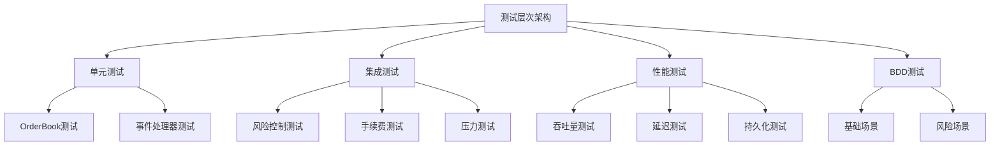
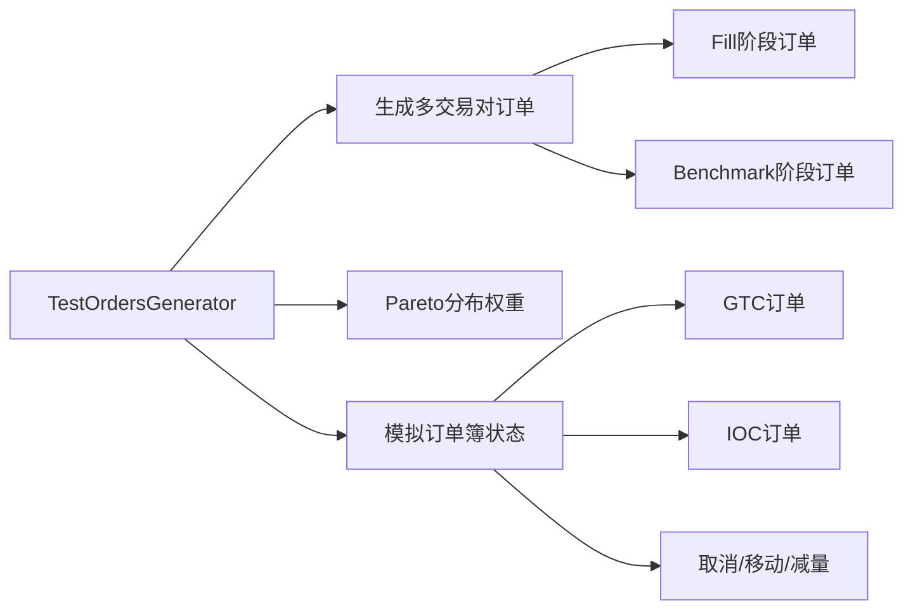
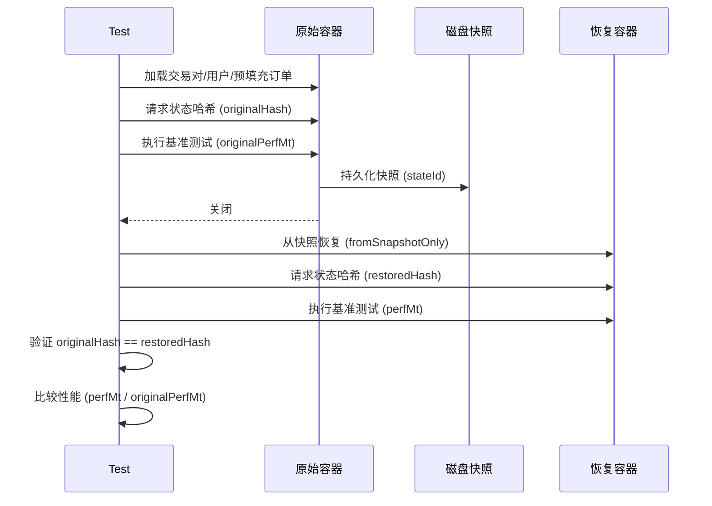

# Exchange-Core 测试方法详细分析

本文档详细分析 exchange-core 项目的测试方法论、测试数据集合以及测试架构。

---

## 📊 项目概览

Exchange-core 是一个高性能的匹配引擎项目，采用多层次的测试策略确保系统正确性和性能表现。



---

## 🔬 测试方法分类

### 1. 单元测试 (Unit Tests)

#### 1.1 OrderBook测试

**位置**: `src/test/java/exchange/core2/core/orderbook/OrderBookBaseTest.java`

| 测试类 | 功能描述 |
|--------|----------|
| `OrderBookBaseTest` | 订单簿基础功能抽象测试类 |
| `OrderBookDirectImplTest` | 直接实现订单簿测试 |
| `OrderBookNaiveImplTest` | 朴素实现订单簿测试 |
| `OrdersBucketNaiveTest` | 订单桶测试 |

**核心测试场景**:
- **订单添加**: GTC/IOC/FOK_BUDGET 订单类型
- **订单取消**: 单个订单删除、批量删除
- **订单匹配**: 部分成交、完全成交、跨价位成交
- **订单移动**: 价格变更触发的匹配
- **风险拒绝**: 资金不足场景

```java
// 测试用初始化订单簿状态示例
@BeforeEach
public void before() {
    orderBook = createNewOrderBook();
    // 初始化 ASK 侧: 81599(75), 81600(100), 200954(10), 201000(60)
    // 初始化 BID 侧: 81593(40), 81590(21), 81200(20), 10000(13), 9136(2)
}
```

#### 1.2 事件处理器测试

**位置**: `src/test/java/exchange/core2/core/SimpleEventsProcessorTest.java`

---

### 2. 集成测试 (Integration Tests)

**位置**: `src/test/java/exchange/core2/tests/integration/`

#### 2.1 核心集成测试

| 测试类 | 测试目标 |
|--------|----------|
| `ITExchangeCoreIntegration` | 完整交易周期 |
| `ITExchangeCoreIntegrationRejection` | 订单拒绝场景 |
| `ITExchangeCoreIntegrationStress` | 压力测试场景 |
| `ITFeesExchange` | 现货交易手续费 |
| `ITFeesMargin` | 保证金交易手续费 |
| `ITMultiOperation` | 多操作并发 |

**核心测试方法**:

```java
// 完整交易周期测试
@Test
public void basicFullCycleTestMargin() {
    basicFullCycleTest(SYMBOLSPEC_EUR_USD);  // 保证金合约
}

@Test  
public void basicFullCycleTestExchange() {
    basicFullCycleTest(SYMBOLSPEC_ETH_XBT);  // 现货交易对
}
```

#### 2.2 风险控制测试

```java
// 资金不足拒绝测试
@Test
public void exchangeRiskBasicTest() {
    container.createUserWithMoney(UID_1, CURRENECY_XBT, 2_000_000);
    // 尝试下单 7 lots @ 300K satoshi - 应被拒绝
    container.submitCommandSync(order101, cmd -> {
        assertThat(cmd.resultCode, is(CommandResultCode.RISK_NSF));
    });
}
```

---

### 3. BDD测试 (Cucumber)

**位置**: `src/test/resources/exchange/core2/tests/features/`

#### 3.1 基础场景 (basic.feature)

```gherkin
Feature: An exchange accepts bid\ask orders, manage and publish order book and match cross orders

  Background:
    Given New client Alice has a balance:
      | USD | 1000000   |
      | XBT | 100000000 |
      | ETH | 100000000 |

  @BasicFullCycleTest
  Scenario Outline: basic full cycle test
    When A client Alice places an ASK order 101 at 1600@7 (type: GTC, symbol: <symbol>)
    And A client Alice places an BID order 102 at 1550@4 (type: GTC, symbol: <symbol>)
    Then An <symbol> order book is:
      | bid | price | ask |
      |     | 1600  | 7   |
      | 4   | 1550  |     |
```

#### 3.2 风险场景 (risk.feature)

```gherkin
@BasicRiskCheck
Scenario: basic scenario
  Given New client Alice has a balance:
    | XBT | 2000000 |
  When A client Alice could not place an BID order 101... due to RISK_NSF
```

#### 3.3 步骤定义

**位置**: `src/test/java/exchange/core2/tests/steps/OrderStepdefs.java`

---

### 4. 性能测试 (Performance Tests)

**位置**: `src/test/java/exchange/core2/tests/perf/`

#### 4.1 吞吐量测试

| 测试方法 | 配置 | 目标 |
|----------|------|------|
| `testThroughputMargin` | 1 ME + 1 RE | 单交易对保证金 |
| `testThroughputExchange` | 1 ME + 1 RE | 单交易对现货 |
| `testThroughputPeak` | 4 ME + 2 RE | 峰值吞吐 |
| `testThroughputMultiSymbolMedium` | 默认 | 1M 用户/1M 订单/10K 交易对 |
| `testThroughputMultiSymbolLarge` | 默认 | 3M 用户/3M 订单/50K 交易对 |
| `testThroughputMultiSymbolHuge` | 4 ME + 2 RE | 10M 用户/30M 订单/100K 交易对 |

```java
// 吞吐量测试核心模块
public static void throughputTestImpl(...) {
    container.executeTestingThread(() -> 
        IntStream.range(0, iterations)
            .mapToObj(j -> {
                container.loadSymbolsUsersAndPrefillOrdersNoLog(testDataFutures);
                float perfMt = container.benchmarkMtps(apiCommandsBenchmark);
                log.info("{}. {} MT/s", j, String.format("%.3f", perfMt));
                // 验证全局余额为零 (无资金泄漏)
                assertTrue(container.totalBalanceReport().isGlobalBalancesAllZero());
                return perfMt;
            })
            .average()
    );
}
```

#### 4.2 延迟测试

```java
// 延迟测试配置
final int targetTps = 200_000;      // 目标 TPS
final int targetTpsStep = 100_000;  // TPS 递增步长
final int warmupTps = 1_000_000;    // 预热 TPS

// 使用 HdrHistogram 记录延迟分布
final SingleWriterRecorder hdrRecorder = new SingleWriterRecorder(Integer.MAX_VALUE, 2);
```

---

## 📦 测试数据集合

### 1. 测试数据参数 (TestDataParameters)

**位置**: `src/test/java/exchange/core2/tests/util/TestDataParameters.java`

| 配置级别 | 用户数 | 待处理订单 | 交易对数 | 交易次数 |
|----------|--------|------------|----------|----------|
| **SinglePair** | 2,000 | 1,000 | 1 | 300万 |
| **Medium** | 330万 | 100万 | 10,000 | 300万 |
| **Large** | 1000万 | 300万 | 50,000 | 300万 |
| **Huge** | 3300万 | 3000万 | 100,000 | 1000万 |

```java
// Medium 配置示例
public static TestDataParametersBuilder mediumBuilder() {
    return TestDataParameters.builder()
        .totalTransactionsNumber(3_000_000)
        .targetOrderBookOrdersTotal(1_000_000)
        .numAccounts(3_300_000)
        .currenciesAllowed(TestConstants.ALL_CURRENCIES)
        .numSymbols(10_000)
        .allowedSymbolTypes(AllowedSymbolTypes.BOTH);
}
```

### 2. 测试常量 (TestConstants)

**位置**: `src/test/java/exchange/core2/tests/util/TestConstants.java`

#### 2.1 货币定义

| 货币类型 | ID | 说明 |
|----------|-----|------|
| USD | 840 | 美元 |
| EUR | 978 | 欧元 |
| XBT | 3762 | 比特币 (satoshi) |
| ETH | 3928 | 以太坊 (szabo) |
| LTC | 4141 | 莱特币 |

#### 2.2 交易对定义

```java
// 保证金合约: EUR/USD
public static final CoreSymbolSpecification SYMBOLSPEC_EUR_USD = CoreSymbolSpecification.builder()
    .symbolId(SYMBOL_MARGIN)
    .type(SymbolType.FUTURES_CONTRACT)
    .baseCurrency(CURRENECY_EUR)
    .quoteCurrency(CURRENECY_USD)
    .baseScaleK(1)
    .quoteScaleK(1)
    .marginBuy(2200)
    .marginSell(3210)
    .build();

// 现货交易对: ETH/XBT
public static final CoreSymbolSpecification SYMBOLSPEC_ETH_XBT = CoreSymbolSpecification.builder()
    .symbolId(SYMBOL_EXCHANGE)
    .type(SymbolType.CURRENCY_EXCHANGE_PAIR)
    .baseCurrency(CURRENECY_ETH)    // base = szabo
    .quoteCurrency(CURRENECY_XBT)   // quote = satoshi
    .baseScaleK(100_000)            // 1 lot = 0.1 ETH
    .quoteScaleK(10)                // 1 step = 10 satoshi
    .build();
```

---

## 🔧 测试数据生成器

### TestOrdersGenerator

**位置**: `src/test/java/exchange/core2/tests/util/TestOrdersGenerator.java`

#### 核心功能



#### 订单生成策略

```java
// 1. 权重分布 - 使用 Pareto 分布模拟真实市场
public static double[] createWeightedDistribution(int size, int seed) {
    final RealDistribution paretoDistribution = 
        new ParetoDistribution(new JDKRandomGenerator(seed), 0.001, 1.5);
    // 归一化处理
}

// 2. 订单类型生成逻辑
private static OrderCommand generateRandomOrder(Session session) {
    // 根据订单簿深度调整策略
    final int lackOfOrders = session.targetOrderBookOrdersHalf - session.lastOrderBookOrdersSize;
    
    if (growOrders) {
        return generateRandomGtcOrder(session);  // 限价单填充
    } else {
        return generateRandomInstantOrder(session);  // IOC/FOKB 即时单
    }
}

// 3. 价格生成 - 围绕最后成交价波动
final int dev = 1 + (int)(Math.pow(rand.nextDouble(), 2) * session.priceDeviation);
final int price = (int)session.lastTradePrice + offset;
```

#### 订单分布统计

生成器会输出订单类型分布:
```
GTC: 45.23%  IOC: 35.12%  FOKB: 1.05%  cancel: 8.32%  move: 7.89%  reduce: 2.39%
```

---

## 🧪 测试容器 (ExchangeTestContainer)

**位置**: `src/test/java/exchange/core2/tests/util/ExchangeTestContainer.java`

### 核心功能

```java
public final class ExchangeTestContainer implements AutoCloseable {
    
    // 1. 创建测试环境
    public static ExchangeTestContainer create(PerformanceConfiguration perfCfg);
    
    // 2. 初始化交易对
    public void initBasicSymbols();
    public void addSymbols(List<CoreSymbolSpecification> symbols);
    
    // 3. 初始化用户账户
    public void initBasicUsers();
    public void userAccountsInit(List<BitSet> userCurrencies);
    
    // 4. 提交命令
    public void submitCommandSync(ApiCommand cmd, Consumer<OrderCommand> validator);
    
    // 5. 查询状态
    public L2MarketData requestCurrentOrderBook(int symbol);
    public SingleUserReportResult getUserProfile(long clientId);
    public TotalCurrencyBalanceReportResult totalBalanceReport();
    
    // 6. 基准测试
    public float benchmarkMtps(List<ApiCommand> commands);
}
```

### 异步测试数据准备

```java
// 并行准备大规模测试数据
public static TestDataFutures prepareTestDataAsync(TestDataParameters params, int seed) {
    // 1. 并行生成交易对规格
    CompletableFuture<List<CoreSymbolSpecification>> symbolsFuture = 
        CompletableFuture.supplyAsync(() -> generateRandomSymbols(...));
    
    // 2. 并行生成用户账户
    CompletableFuture<List<BitSet>> usersFuture = 
        CompletableFuture.supplyAsync(() -> UserCurrencyAccountsGenerator.generateUsers(...));
    
    // 3. 合并后生成订单
    CompletableFuture<MultiSymbolGenResult> genResultFuture = 
        symbolsFuture.thenCombineAsync(usersFuture, ...);
}
```

---

## 📈 测试验证策略

### 1. 状态一致性验证

```java
// 每次测试迭代后验证
assertTrue(container.totalBalanceReport().isGlobalBalancesAllZero());

// 订单簿最终状态比对
testDataFutures.coreSymbolSpecifications.join().forEach(symbol -> 
    assertEquals(
        expectedSnapshot,
        container.requestCurrentOrderBook(symbol.symbolId)
    )
);
```

### 2. 哈希状态验证

```java
// 获取系统状态哈希用于快照比对
public int requestStateHash() {
    return api.processReport(new StateHashReportQuery(), transferId).get().getStateHash();
}
```

### 3. 事件验证辅助方法

```java
// 验证交易事件
void checkEventTrade(MatcherTradeEvent evt, long matchedOrderId, long price, long size);

// 验证削减事件
void checkEventReduce(MatcherTradeEvent evt, long size, long price, boolean completed, Long holdPrice);

// 验证拒绝事件
void checkEventRejection(MatcherTradeEvent evt, long size, long price, long budget);
```

---

## 🚀 测试运行配置

### Cucumber 测试运行器

```java
@Suite
@IncludeEngines("cucumber")
@SelectClasspathResources({
    @SelectClasspathResource("exchange/core2/tests/features/basic.feature"),
    @SelectClasspathResource("exchange/core2/tests/features/risk.feature")
})
public class RunCukeNaiveTests {
    // 使用基础性能配置
    OrderStepdefs.testPerformanceConfiguration = PerformanceConfiguration.baseBuilder().build();
}
```

### 性能配置级别

| 配置类型 | RingBuffer | Matching Engines | Risk Engines |
|----------|------------|------------------|--------------|
| Base | 16K | 1 | 1 |
| Throughput | 32K | 4 | 2 |
| Latency | 2K | 1 | 1 |

---

## 📋 测试执行矩阵

| 测试类型 | 执行命令 | 预计时间 |
|----------|----------|----------|
| 单元测试 | `mvn test -Dtest=OrderBook*Test` | < 1分钟 |
| Cucumber测试 | `mvn test -Dtest=RunCuke*` | < 2分钟 |
| 集成测试 | `mvn test -Dtest=IT*` | 5-10分钟 |
| 性能测试 | `mvn test -Dtest=Perf*` | 20-60分钟 |

---

## 💾 持久化与日志测试

### 1. 快照持久化测试 (PersistenceTestsModule)

**位置**: `src/test/java/exchange/core2/tests/util/PersistenceTestsModule.java`



**核心验证逻辑**:
```java
// 1. 创建快照
final ApiPersistState apiPersistState = ApiPersistState.builder().dumpId(stateId).build();
container.getApi().submitCommandAsync(apiPersistState).get();

// 2. 记录原始状态哈希
originalPrefillStateHash = container.requestStateHash();

// 3. 从快照恢复后验证
final long restoredPrefillStateHash = recreatedContainer.requestStateHash();
assertThat(restoredPrefillStateHash, is(originalPrefillStateHash));

// 4. 性能比较
final float perfRatioPerc = perfMt / originalPerfMt * 100f;
log.info("restored throughput: {} MT/s ({}%)", perfMt, perfRatioPerc);
```

### 2. 日志重放测试 (JournalingTestsModule)

**位置**: `src/test/java/exchange/core2/tests/util/JournalingTestsModule.java`

| 特性 | 快照测试 | 日志测试 |
|------|----------|----------|
| 序列化配置 | `DISK_SNAPSHOT_ONLY` | `DISK_JOURNALING` |
| 恢复方式 | 仅快照 | 快照 + 日志重放 |
| 验证时机 | 预填充后 | 完整执行后 |
| 初始化配置 | `cleanStart` | `cleanStartJournaling` |

```java
// 日志测试特有流程
// 1. 创建快照作为检查点
container.getApi().submitCommandAsync(apiPersistState).get();

// 2. 继续执行命令 (这些会记录到日志)
container.getApi().submitCommandsSync(genResult.getApiCommandsBenchmark().join());

// 3. 记录最终状态哈希
originalFinalStateHash = container.requestStateHash();

// 4. 从快照+日志恢复
InitialStateConfiguration.lastKnownStateFromJournal(exchangeId, stateId, snapshotBaseSeq);

// 5. 恢复后验证最终状态一致
assertThat(restoredStateHash, is(originalFinalStateHash));
```

---

## 📈 NASDAQ 真实市场数据测试

**位置**: `src/test/java/exchange/core2/tests/nasdaq/NasdaqReader.java`

### 功能描述

使用真实的 NASDAQ ITCH 5.0 协议数据进行回放测试，验证系统在真实市场负载下的表现。

```java
// NASDAQ ITCH 数据文件
final String pathname = "../../nasdaq/01302020.NASDAQ_ITCH50";
// 或 PSX/BX 数据
// final String pathname = "../../nasdaq/20190730.PSX_ITCH_50";
// final String pathname = "../../nasdaq/20190730.BX_ITCH_50";

// 使用 Juncture 库解析 ITCH 协议
ITCH50StatListener statListener = new ITCH50StatListener();
ITCH50Parser listener = new ITCH50Parser(statListener);
BinaryFILE.read(new File(pathname), listener);
```

### 用户 ID 映射

```java
// 将订单ID哈希映射到用户ID (0到 numUsers-1)
public static int hashToUid(long orderId, int numUsersMask) {
    long x = ((orderId * 0xcc9e2d51) << 15) * 0x1b873593;
    return 1 + ((int) (x >> 32 ^ x) & numUsersMask);
}
```

---

## 👥 用户账户生成器

**位置**: `src/test/java/exchange/core2/tests/util/UserCurrencyAccountsGenerator.java`

### 生成策略

使用 **Pareto 分布** (α=1.5) 模拟真实世界中用户持有货币数量的不均匀分布：

```java
// Pareto 分布生成用户账户数量
final RealDistribution paretoDistribution = new ParetoDistribution(
    new JDKRandomGenerator(0), 1, 1.5);

// 每个用户持有 1 到 currencyCodes.length 种货币
final int accountsToOpen = Math.min(
    Math.min(1 + (int)paretoDistribution.sample(), currencyCodes.length), 
    totalAccountsQuota);
```

### 符号用户筛选

为特定交易对筛选具有必要货币的用户：

```java
public static int[] createUserListForSymbol(
    List<BitSet> users2currencies, 
    CoreSymbolSpecification spec, 
    int symbolMessagesExpected) {
    
    // 筛选条件:
    // - 用户必须持有报价货币 (quoteCurrency)
    // - 如果是现货交易, 还必须持有基础货币 (baseCurrency)
    if (accounts.get(spec.quoteCurrency) && 
        (spec.type == SymbolType.FUTURES_CONTRACT || accounts.get(spec.baseCurrency))) {
        uids.add(uid);
    }
}
```

---

## 🔄 订单生成会话管理

**位置**: `src/test/java/exchange/core2/tests/util/TestOrdersGeneratorSession.java`

### 会话状态

| 状态字段 | 说明 |
|----------|------|
| `orderPrices` | 订单ID → 价格映射 |
| `orderSizes` | 订单ID → 数量映射 |
| `orderUids` | 订单ID → 用户ID映射 |
| `lastTradePrice` | 最后成交价 (价格锚点) |
| `priceDirection` | 价格趋势方向 (1/-1/0) |
| `priceDeviation` | 价格波动范围 |

### 价格生成算法

```java
// 初始价格: 10^3.3 到 10^6.3 范围内随机
int price = (int) Math.pow(10, 3.3 + rand.nextDouble() * 1.5 + rand.nextDouble() * 1.5);

// 价格波动: 最大 5% 或 10000 点
this.priceDeviation = Math.min((int)(price * 0.05), 10000);

// 价格范围
this.minPrice = price - priceDeviation * 5;
this.maxPrice = price + priceDeviation * 5;
```

### 统计计数器

```java
// 交易统计
long numCompleted = 0;  // 完全成交
long numRejected = 0;   // 被拒绝
long numReduced = 0;    // 部分取消

// 操作统计
long counterPlaceMarket = 0;  // 市价单
long counterPlaceLimit = 0;   // 限价单
long counterCancel = 0;       // 取消
long counterMove = 0;         // 移动
long counterReduce = 0;       // 减量
```

---

## 🔍 关键测试模式总结

1. **分层测试设计**: 单元测试 → 集成测试 → 性能测试 → BDD场景测试
2. **数据分布策略**: 使用 Pareto 分布模拟真实市场的订单集中度
3. **状态验证**: 全局余额零和验证 + 订单簿快照比对
4. **异步测试数据生成**: 利用 CompletableFuture 并行准备大规模测试数据
5. **参数化测试配置**: 支持从小规模到超大规模 (10M用户/30M订单) 的灵活配置
6. **持久化验证**: 快照和日志重放后状态哈希一致性检查
7. **真实数据回放**: 支持 NASDAQ ITCH 5.0 协议数据回放测试

---

## 🛠️ 测试辅助工具类

### 1. 延迟报告工具 (LatencyTools)

**位置**: `src/test/java/exchange/core2/tests/util/LatencyTools.java`

使用 **HdrHistogram** 库生成延迟百分位报告：

```java
// 报告的百分位
private static final double[] PERCENTILES = new double[]{50, 90, 95, 99, 99.9, 99.99};

// 生成延迟报告
public static Map<String, String> createLatencyReportFast(Histogram histogram) {
    final Map<String, String> fmt = new LinkedHashMap<>();
    Arrays.stream(PERCENTILES).forEach(p -> 
        fmt.put(p + "%", formatNanos(histogram.getValueAtPercentile(p))));
    fmt.put("W", formatNanos(histogram.getMaxValue()));  // Worst case
    return fmt;
}

// 输出示例: {50%=1.2µs, 90%=2.5µs, 95%=4.1µs, 99%=8.3µs, 99.9%=15µs, 99.99%=120µs, W=1.2ms}
```

### 2. 订单簿辅助类 (L2MarketDataHelper)

**位置**: `src/test/java/exchange/core2/tests/util/L2MarketDataHelper.java`

用于构建和操作预期的 L2 订单簿状态：

| 方法类别 | 示例方法 | 功能 |
|----------|----------|------|
| 设置 | `setAskVolume(pos, vol)` | 设置指定位置的卖盘量 |
| 插入 | `insertAsk(pos, price, vol)` | 在指定位置插入卖盘 |
| 删除 | `removeAsk(pos)` | 删除指定位置的卖盘 |
| 增减 | `decrementBidVolume(pos, diff)` | 减少买盘量 |
| 聚合 | `aggregateBuyBudget(size)` | 计算买入所需预算 |
| 显示 | `dumpOrderBook(l2)` | 格式化输出订单簿 |

**流式操作示例**:
```java
L2MarketDataHelper expected = new L2MarketDataHelper()
    .addAsk(1600, 7)
    .addBid(1550, 4)
    .setAskVolume(0, 5)      // 修改卖盘量
    .insertBid(0, 1583, 4)   // 插入新买盘
    .removeBid(1)            // 删除旧买盘
    .build();
```

---

## 🔥 压力测试与 Hiccup 检测

### 1. Hiccup 测试 (PerfHiccups)

**位置**: `src/test/java/exchange/core2/tests/perf/PerfHiccups.java`

检测系统延迟抖动（GC暂停、JIT编译等）：

```java
// Hiccup 阈值: 200微秒
final long hiccupThresholdNs = 200_000;

// 记录超过阈值的延迟事件
if (diffNs > hiccupThresholdNs) {
    hiccupTimestampsNs.put(cmd.timestamp, diffNs);
    nextHiccupAcceptTimestampNs.value = cmd.timestamp + diffNs;
}

// 输出示例:
// 12:34:56.789: 450µs
// 12:34:57.123: 1200µs
```

### 2. 压力测试 (ITExchangeCoreIntegrationStress)

**位置**: `src/test/java/exchange/core2/tests/integration/ITExchangeCoreIntegrationStress.java`

| 参数 | 值 |
|------|-----|
| 订单数量 | 1,000,000 |
| 目标订单簿深度 | 1,000 |
| 用户数量 | 1,000 |
| 超时时间 | 60秒 |

**验证流程**:
1. 生成100万条命令
2. 初始化用户并验证余额
3. 执行所有命令
4. 比对最终订单簿快照
5. 验证余额未发生泄漏

---

## 📊 完整性能测试矩阵

### 吞吐量测试 (PerfThroughput)

| 测试方法 | 用户数 | 订单数 | 交易对 | ME | RE | 迭代 |
|----------|--------|--------|--------|-----|-----|------|
| `testThroughputMargin` | 2K | 1K | 1 | 1 | 1 | 50 |
| `testThroughputExchange` | 2K | 1K | 1 | 1 | 1 | 50 |
| `testThroughputPeak` | 10K | 10K | 100 | 4 | 2 | 50 |
| `testThroughputMultiSymbolMedium` | 3.3M | 1M | 10K | 4 | 4 | 25 |
| `testThroughputMultiSymbolLarge` | 10M | 3M | 50K | 4 | 4 | 25 |
| `testThroughputMultiSymbolHuge` | 33M | 30M | 100K | 4 | 2 | 25 |

### 延迟测试 (PerfLatency)

| 测试方法 | RingBuffer | ME | RE | 预热次数 |
|----------|------------|-----|-----|----------|
| `testLatencyMargin` | 2K | 1 | 1 | 16 |
| `testLatencyExchange` | 2K | 1 | 1 | 16 |
| `testLatencyMultiSymbolMedium` | 32K | 4 | 2 | 8 |
| `testLatencyMultiSymbolLarge` | 32K | 4 | 2 | 4 |
| `testLatencyMultiSymbolHuge` | 64K | 4 | 2 | 2 |

### 持久化测试 (PerfPersistence)

| 测试方法 | 数据规模 | 迭代 | 磁盘需求 |
|----------|----------|------|----------|
| `testPersistenceMargin` | SinglePair | 10 | < 1GB |
| `testPersistenceExchange` | SinglePair | 10 | < 1GB |
| `testPersistenceMultiSymbolMedium` | Medium | 25 | 10+ GB |
| `testPersistenceMultiSymbolLarge` | Large | 25 | 20+ GB |
| `testPersistenceMultiSymbolHuge` | Huge | 25 | 50+ GB |

### 日志测试 (PerfJournaling)

| 测试方法 | 数据规模 | ME | RE | 特殊配置 |
|----------|----------|-----|-----|----------|
| `testJournalingMargin` | SinglePair | 1 | 1 | - |
| `testJournalingExchange` | SinglePair | 1 | 1 | - |
| `testJournalingMultiSymbolSmall` | 100K用户/50K订单 | 2 | 2 | 1000交易对 |
| `testJournalingMultiSymbolMedium` | Medium | 4 | 2 | - |
| `testJournalingMultiSymbolLarge` | Large | 4 | 4 | - |
| `testJournalingMultiSymbolHuge` | Huge | 4 | 4 | RingBuffer 128K |

---

## 🎯 测试执行指南

### 快速验证（开发阶段）

```bash
# 单元测试 (~1分钟)
mvn test -Dtest=OrderBook*Test

# Cucumber BDD测试 (~2分钟)
mvn test -Dtest=RunCuke*
```

### 完整验证（CI/CD）

```bash
# 集成测试 (~10分钟)
mvn test -Dtest=IT*

# 基础性能测试 (~30分钟)
mvn test -Dtest=PerfThroughput#testThroughputMargin
mvn test -Dtest=PerfLatency#testLatencyMargin
```

### 大规模验证（发布前）

```bash
# 需要 32GB RAM + 12核CPU
mvn test -Dtest=PerfThroughput#testThroughputMultiSymbolHuge
mvn test -Dtest=PerfPersistence#testPersistenceMultiSymbolHuge
```

---

## 📝 结论

Exchange-core 项目采用了**多层次、多维度**的测试策略：

1. **功能正确性**: 单元测试 + BDD 场景测试
2. **集成验证**: 完整交易周期 + 风险控制 + 手续费
3. **性能基准**: 吞吐量 + 延迟百分位 + Hiccup检测
4. **可靠性验证**: 快照持久化 + 日志重放
5. **真实负载**: NASDAQ ITCH 协议回放
6. **数据模拟**: Pareto分布 + 随机价格波动

这套测试体系确保了系统在从**2K用户到33M用户**的各种规模下都能正确、高效地运行。
