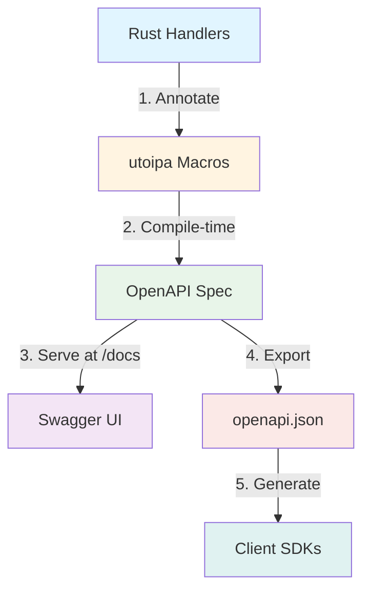
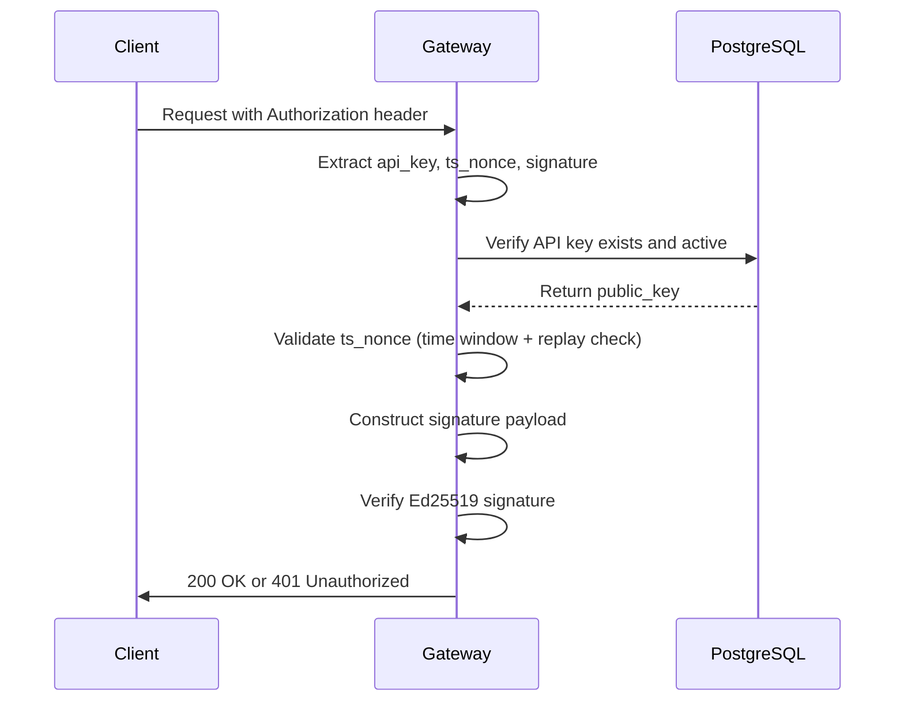

# 0x0E OpenAPI Integration | OpenAPI 集成

> **Status**: DRAFT  
> **Author**: Architect Team  
> **Date**: 2025-12-25

## 1. Design Goals | 设计目标

### Problem Statement | 问题陈述

The Zero X Infinity Gateway API currently lacks formal API documentation, making it difficult for:
- External developers to discover and integrate with the API
- Frontend teams to understand request/response contracts
- API consumers to auto-generate client SDKs
- QA teams to validate API compliance

Zero X Infinity Gateway API 目前缺少正式的 API 文档,导致以下问题:
- 外部开发者难以发现和集成 API
- Frontend 团队难以理解请求/响应契约
- API 消费者无法自动生成客户端 SDK
- QA 团队无法验证 API 合规性

### Technical Objectives | 技术目标

1. **Auto-generated Documentation**: Provide interactive OpenAPI 3.0 documentation accessible via `/docs`
2. **Type Safety**: Ensure documentation stays in sync with implementation (single source of truth)
3. **Authentication Documentation**: Document Ed25519 signature-based authentication flow
4. **Client SDK Generation**: Enable auto-generation of client libraries (Python, TypeScript, Go, etc.)
5. **Zero Breaking Changes**: Integrate without modifying existing API behavior

1. **自动生成文档**: 提供可通过 `/docs` 访问的交互式 OpenAPI 3.0 文档
2. **类型安全**: 确保文档与实现保持同步(单一事实来源)
3. **认证文档**: 记录基于 Ed25519 签名的认证流程
4. **客户端 SDK 生成**: 支持自动生成客户端库(Python、TypeScript、Go 等)
5. **零破坏性变更**: 在不修改现有 API 行为的前提下集成

---

## 2. Core Principles | 核心原则

### Principle 1: Code-First Approach | 代码优先方法

**Decision**: Use code-first OpenAPI generation (via `utoipa` crate) instead of spec-first design.

**Rationale**:
- **Single Source of Truth**: Rust type definitions are the contract; OpenAPI is generated from code
- **Type Safety**: Rust compiler ensures schema accuracy
- **No Drift**: Documentation automatically stays in sync with implementation
- **Developer Experience**: Developers update Rust code only, not separate YAML files

**决策**: 使用代码优先的 OpenAPI 生成(通过 `utoipa` crate),而非规范优先设计。

**理由**:
- **单一事实来源**: Rust 类型定义是契约,OpenAPI 从代码生成
- **类型安全**: Rust 编译器确保 Schema 准确性
- **无漂移**: 文档自动与实现保持同步
- **开发者体验**: 开发者只需更新 Rust 代码,无需维护独立的 YAML 文件

### Principle 2: Incremental Adoption | 增量采用

**Decision**: Adopt OpenAPI documentation incrementally, starting with public routes.

**Rationale**:
- **Low Risk**: Start with public market data endpoints (no breaking changes)
- **Fast Iteration**: Validate approach before documenting complex private routes
- **Continuous Value**: Deliver usable documentation in phases

**决策**: 增量采用 OpenAPI 文档,从公共路由开始。

**理由**:
- **低风险**: 从公共市场数据端点开始(无破坏性变更)
- **快速迭代**: 在记录复杂私有路由前验证方法
- **持续价值**: 分阶段交付可用文档

### Principle 3: Security-First Documentation | 安全优先文档

**Decision**: Clearly document Ed25519 authentication requirements and payload construction.

**Rationale**:
- **Prevent Misuse**: Detailed auth docs reduce integration errors
- **Security Transparency**: Clearly specify signature algorithm, payload format, and replay protection
- **Compliance**: Support security audits with comprehensive auth documentation

**决策**: 清晰记录 Ed25519 认证要求和 Payload 构造。

**理由**:
- **防止误用**: 详细的认证文档减少集成错误
- **安全透明**: 明确指定签名算法、Payload 格式和重放保护
- **合规性**: 通过全面的认证文档支持安全审计

---

## 3. Technology Choice | 技术选型

### Selected Library: `utoipa` | 选择库: `utoipa`

```toml
[dependencies]
utoipa = { version = "5.3", features = ["axum_extras", "chrono", "uuid"] }
utoipa-swagger-ui = { version = "8.0", features = ["axum"] }
```

#### Why `utoipa`? | 为什么选择 `utoipa`?

| Criterion | Assessment |
|-----------|------------|
| **Axum Integration** | ✅ First-class support for Axum 0.6+ via `#[utoipa::path]` macro |
| **Type Safety** | ✅ Generates OpenAPI from Rust types (single source of truth) |
| **Maintenance** | ✅ Active development, 2.7k+ GitHub stars |
| **Features** | ✅ Supports Swagger UI, ReDoc, security schemes, custom schemas |
| **Performance** | ✅ Zero runtime cost (compile-time generation) |
| **Ecosystem** | ✅ Works with `serde`, `chrono`, `uuid` out of the box |

#### Alternatives Considered | 考虑的备选方案

- **`paperclip`**: ❌ Requires OpenAPI 2.0 (Swagger), not OpenAPI 3.0
- **`rweb`**: ❌ Less active maintenance, smaller community
- **Hand-written YAML**: ❌ High maintenance burden, drift from code

---

## 4. Architecture Design | 架构设计

### 4.1 Integration Overview | 集成概览



**Flow**:
1. Developers annotate handlers with `#[utoipa::path]`
2. `utoipa` generates OpenAPI spec at compile time
3. Swagger UI serves interactive docs at `/docs`
4. Export `openapi.json` for client SDK generation
5. Auto-generate clients with `openapi-generator`

**流程**:
1. 开发者用 `#[utoipa::path]` 注解处理器
2. `utoipa` 在编译时生成 OpenAPI 规范
3. Swagger UI 在 `/docs` 提供交互式文档
4. 导出 `openapi.json` 用于客户端 SDK 生成
5. 使用 `openapi-generator` 自动生成客户端

### 4.2 Component Breakdown | 组件分解

#### Component 1: Handler Annotations | 处理器注解

**File**: `src/gateway/handlers.rs`

**Implementation**:
```rust
use utoipa::OpenApi;

#[utoipa::path(
    get,
    path = "/api/v1/public/depth",
    params(
        ("symbol" = Option<String>, Query, description = "Trading pair (e.g., BTC_USDT)"),
        ("limit" = Option<u32>, Query, description = "Depth levels (default: 20, max: 100)")
    ),
    responses(
        (status = 200, description = "Order book depth", body = ApiResponse<DepthApiData>),
        (status = 400, description = "Invalid parameters", body = ApiResponse<()>),
        (status = 503, description = "Service unavailable", body = ApiResponse<()>)
    ),
    tag = "Market Data"
)]
pub async fn get_depth(
    State(state): State<Arc<AppState>>,
    Query(params): Query<HashMap<String, String>>,
) -> Result<(StatusCode, Json<ApiResponse<DepthApiData>>), (StatusCode, Json<ApiResponse<()>>)> {
    // ... existing implementation ...
}
```

#### Component 2: Schema Definitions | Schema 定义

**File**: `src/gateway/types.rs`

**Implementation**:
```rust
use utoipa::ToSchema;

/// API Response wrapper
#[derive(Serialize, ToSchema)]
pub struct ApiResponse<T> {
    /// Response code: 0 for success, non-zero for errors
    #[schema(example = 0)]
    pub code: u32,
    
    /// Error message (only present if code != 0)
    #[schema(example = "")]
    pub msg: Option<String>,
    
    /// Response data (only present if code == 0)
    pub data: Option<T>,
}

/// Order book depth data
#[derive(Serialize, ToSchema)]
pub struct DepthApiData {
    /// Trading symbol name
    #[schema(example = "BTC_USDT")]
    pub symbol: String,
    
    /// Bid levels [[price, quantity], ...]
    #[schema(example = json!([["85000.00", "0.5"], ["84999.00", "1.2"]]))]
    pub bids: Vec<[String; 2]>,
    
    /// Ask levels [[price, quantity], ...]
    #[schema(example = json!([["85001.00", "0.3"], ["85002.00", "0.8"]]))]
    pub asks: Vec<[String; 2]>,
}
```

#### Component 3: OpenAPI Doc Generator | OpenAPI 文档生成器

**File**: `src/gateway/openapi.rs` (new)

**Implementation**:
```rust
use utoipa::OpenApi;
use utoipa::openapi::security::{ApiKey, ApiKeyValue, SecurityScheme};

#[derive(OpenApi)]
#[openapi(
    info(
        title = "Zero X Infinity Exchange API",
        version = "1.0.0",
        description = "High-performance cryptocurrency exchange API achieving 1.3M orders/sec",
        contact(
            name = "API Support",
            email = "[email protected]"
        ),
        license(
            name = "MIT"
        )
    ),
    servers(
        (url = "https://api.zero-x-infinity.com", description = "Production"),
        (url = "http://localhost:8080", description = "Development")
    ),
    paths(
        // Public endpoints
        handlers::get_depth,
        handlers::get_klines,
        handlers::get_assets,
        handlers::get_symbols,
        handlers::get_exchange_info,
        handlers::health_check,
        
        // Private endpoints (auth required)
        handlers::create_order,
        handlers::cancel_order,
        handlers::get_orders,
        handlers::get_order,
        handlers::get_trades,
        handlers::get_balances,
        handlers::get_all_balances,
        handlers::create_transfer,
        handlers::get_transfer,
    ),
    components(
        schemas(
            types::ApiResponse<()>,
            types::DepthApiData,
            types::ClientOrder,
            types::OrderResponseData,
            types::CancelOrderRequest,
            // ... other schemas
        )
    ),
    modifiers(&SecurityAddon),
    tags(
        (name = "Market Data", description = "Public market data endpoints"),
        (name = "Trading", description = "Order placement and management (auth required)"),
        (name = "Account", description = "Account queries and balance management (auth required)"),
        (name = "Transfer", description = "Internal fund transfers (auth required)"),
        (name = "System", description = "Health checks and system info")
    )
)]
pub struct ApiDoc;

/// Add Ed25519 security scheme
struct SecurityAddon;

impl utoipa::Modify for SecurityAddon {
    fn modify(&self, openapi: &mut utoipa::openapi::OpenApi) {
        if let Some(components) = openapi.components.as_mut() {
            components.add_security_scheme(
                "Ed25519Auth",
                SecurityScheme::Http(
                    utoipa::openapi::security::Http::new(
                        utoipa::openapi::security::HttpAuthScheme::Bearer
                    ).description(Some(
                        "Ed25519 signature-based authentication.  
                        
**Header Format**:  
```
Authorization: Bearer {api_key}:{ts_nonce}:{signature}
```

**Signature Payload**:  
```plaintext
{api_key}|{ts_nonce}|{method}|{path}|{body}
```

**Signature Algorithm**: Ed25519  
**Replay Protection**: Monotonic `ts_nonce` (Unix milliseconds)  
**Time Window**: 30 seconds  

See [Authentication Guide](#) for examples."
                    ))
                )
            )
        }
    }
}
```

#### Component 4: Swagger UI Integration | Swagger UI 集成

**File**: `src/gateway/mod.rs`

**Modification**:
```rust
use utoipa_swagger_ui::SwaggerUi;

pub async fn run_server(/* ... existing params ... */) {
    // ... existing setup ...
    
    // Build router with Swagger UI
    let app = Router::new()
        // Existing routes
        .route("/ws", get(ws_handler))
        .route("/api/v1/health", get(handlers::health_check))
        .nest("/api/v1/public", public_routes)
        .nest("/api/v1/private", private_routes)
        // NEW: Add Swagger UI
        .merge(
            SwaggerUi::new("/docs")
                .url("/api-docs/openapi.json", openapi::ApiDoc::openapi())
        )
        .with_state(state);
    
    // ... existing server start ...
}
```

---

## 5. API Endpoint Documentation | API 端点文档

### 5.1 Public Endpoints | 公共端点

| Endpoint | Method | Description | Auth Required |
|----------|--------|-------------|---------------|
| `/api/v1/public/depth` | GET | Get order book depth | ❌ No |
| `/api/v1/public/klines` | GET | Get K-line/candlestick data | ❌ No |
| `/api/v1/public/assets` | GET | List all supported assets | ❌ No |
| `/api/v1/public/symbols` | GET | List all trading pairs | ❌ No |
| `/api/v1/public/exchange_info` | GET | Get exchange metadata | ❌ No |
| `/api/v1/health` | GET | Health check | ❌ No |

### 5.2 Private Endpoints | 私有端点

| Endpoint | Method | Description | Auth Required |
|----------|--------|-------------|---------------|
| `/api/v1/private/order` | POST | Create order | ✅ Yes |
| `/api/v1/private/cancel` | POST | Cancel order | ✅ Yes |
| `/api/v1/private/orders` | GET | Query user orders | ✅ Yes |
| `/api/v1/private/order/{order_id}` | GET | Get single order | ✅ Yes |
| `/api/v1/private/trades` | GET | Query trade history | ✅ Yes |
| `/api/v1/private/balances` | GET | Get balance (single asset) | ✅ Yes |
| `/api/v1/private/balances/all` | GET | Get all balances | ✅ Yes |
| `/api/v1/private/transfer` | POST | Create internal transfer | ✅ Yes |
| `/api/v1/private/transfer/{req_id}` | GET | Get transfer status | ✅ Yes |

---

## 6. Ed25519 Authentication Documentation | Ed25519 认证文档

### Authentication Flow | 认证流程



### Signature Construction | 签名构造

**Header Format** (included in OpenAPI spec):
```
Authorization: Bearer {api_key}:{ts_nonce}:{signature}
```

**Signature Payload**:
```plaintext
{api_key}|{ts_nonce}|{method}|{path}|{body}
```

**Example** (POST /api/v1/private/order):
```json
// Request
POST /api/v1/private/order?symbol=BTC_USDT
Authorization: Bearer abc123:1703499600000:ed25519_sig_base64

// Signature payload
"abc123|1703499600000|POST|/api/v1/private/order?symbol=BTC_USDT|{\"side\":\"BUY\",\"price\":\"85000.00\",\"qty\":\"0.001\"}"
```

**Security Parameters** (documented in OpenAPI):
- **Algorithm**: Ed25519
- **Encoding**: Base64 for signature
- **Time Window**: 30 seconds
- **Replay Protection**: Monotonic `ts_nonce` (milliseconds since epoch)

---

## 7. Implementation Plan | 实施计划

### Phase 1: Foundation (P0 - 1 day) | 基础阶段

**Goal**: Integrate `utoipa` and serve Swagger UI at `/docs`

**Tasks**:
- [ ] 1.1: Add dependencies to `Cargo.toml`
- [ ] 1.2: Create `src/gateway/openapi.rs` with `ApiDoc`
- [ ] 1.3: Integrate Swagger UI in `src/gateway/mod.rs`
- [ ] 1.4: Verify `/docs` serves empty OpenAPI spec

**Acceptance Criteria**:
- ✅ Swagger UI accessible at `http://localhost:8080/docs`
- ✅ OpenAPI JSON downloadable at `http://localhost:8080/api-docs/openapi.json`
- ✅ No existing API endpoints broken

---

### Phase 2: Public Endpoints (P0 - 1 day) | 公共端点

**Goal**: Document all public market data endpoints

**Tasks**:
- [ ] 2.1: Annotate `get_depth` with `#[utoipa::path]`
- [ ] 2.2: Annotate `get_klines` with `#[utoipa::path]`
- [ ] 2.3: Annotate `get_assets`, `get_symbols`, `get_exchange_info`
- [ ] 2.4: Add `ToSchema` derive to `DepthApiData`, `KLineApiData`, etc.
- [ ] 2.5: Update `ApiDoc` paths list with public endpoints
- [ ] 2.6: Add examples to all schema fields

**Acceptance Criteria**:
- ✅ All 6 public endpoints visible in Swagger UI
- ✅ Request/response schemas accurate and complete
- ✅ Example values provided for all fields
- ✅ "Try it out" functionality works in Swagger UI

---

### Phase 3: Private Endpoints (P1 - 2 days) | 私有端点

**Goal**: Document authenticated trading and account endpoints

**Tasks**:
- [ ] 3.1: Annotate `create_order`, `cancel_order`
- [ ] 3.2: Annotate `get_orders`, `get_order`, `get_trades`
- [ ] 3.3: Annotate `get_balances`, `get_all_balances`
- [ ] 3.4: Annotate `create_transfer`, `get_transfer`
- [ ] 3.5: Add `ToSchema` to all private endpoint types
- [ ] 3.6: Implement `SecurityAddon` for Ed25519 auth documentation

**Acceptance Criteria**:
- ✅ All 9 private endpoints visible in Swagger UI
- ✅ Security scheme "Ed25519Auth" documented with examples
- ✅ "Authorize" button in Swagger UI shows auth instructions
- ✅ Error responses (400, 401, 503) documented

---

### Phase 4: Client SDK Generation (P2 - 1 day) | 客户端 SDK 生成

**Goal**: Enable auto-generation of Python/TypeScript clients

**Tasks**:
- [ ] 4.1: Export `openapi.json` to `docs/openapi.json`
- [ ] 4.2: Write script: `scripts/generate_clients.sh`
- [ ] 4.3: Generate Python client with `openapi-generator-cli`
- [ ] 4.4: Generate TypeScript client
- [ ] 4.5: Validate generated clients with example requests

**Acceptance Criteria**:
- ✅ `openapi.json` checked into version control
- ✅ Python client generated in `clients/python/`
- ✅ TypeScript client generated in `clients/typescript/`
- ✅ Both clients successfully create order in dev environment

---

## 8. Verification Plan | 验证计划

### 8.1 Automated Tests | 自动化测试

#### Test 1: OpenAPI Spec Validation
```bash
# Validate OpenAPI spec against OpenAPI 3.0 schema
npx @apidevtools/swagger-cli validate docs/openapi.json
```

#### Test 2: Swagger UI Accessibility
```bash
# Verify Swagger UI is reachable
curl -s http://localhost:8080/docs | grep "Swagger UI"
```

#### Test 3: Schema Completeness
```bash
# Check all handlers are documented
cargo test --package zero_x_infinity --lib gateway::openapi::tests::test_all_routes_documented
```

### 8.2 Manual Verification | 手动验证

#### Checklist:
- [ ] Navigate to `http://localhost:8080/docs`
- [ ] Expand "Market Data" tag → verify all 6 public endpoints visible
- [ ] Click "GET /api/v1/public/depth" → verify request parameters documented
- [ ] Click "Try it out" → execute request → verify response matches schema
- [ ] Expand "Trading" tag → verify private endpoints show lock icon
- [ ] Click "Authorize" → verify Ed25519 auth instructions displayed
- [ ] Download `openapi.json` → verify file is valid JSON

---

## 9. Key Design Decisions | 关键设计决策

### Decision 1: Code-First vs. Spec-First | 代码优先 vs 规范优先

| Approach | Pros | Cons | Decision |
|----------|------|------|----------|
| **Code-First** (`utoipa`) | Single source of truth, type-safe, no drift | Requires annotations, compile-time overhead | ✅ **Selected** |
| **Spec-First** (YAML) | Language-agnostic, tooling-friendly | Drift from code, manual maintenance | ❌ Rejected |

**Rationale**: Rust's type system provides stronger guarantees than hand-written YAML. Code-first ensures documentation accuracy.

### Decision 2: Annotation Strategy | 注解策略

**Decision**: Use `#[utoipa::path]` macro on every handler function.

**Alternatives**:
- ❌ Auto-discovery via `axum` router: Not supported by `utoipa`
- ❌ Centralized schema definitions: Harder to maintain, decoupled from handlers

**Rationale**: Co-locating documentation with code improves discoverability and reduces maintenance burden.

### Decision 3: Authentication Documentation Approach | 认证文档方法

**Decision**: Use `SecurityScheme::Http` with detailed description, not `ApiKey`.

**Rationale**:
- Ed25519 auth uses `Authorization: Bearer` header (HTTP Bearer scheme)
- Custom payload construction requires detailed prose explanation
- OpenAPI `ApiKey` scheme doesn't support signature algorithm documentation

---

## 10. Risks & Mitigation | 风险与缓解

| Risk | Impact | Probability | Mitigation |
|------|--------|-------------|------------|
| **Schema drift** | API docs become inaccurate | Medium | CI check: validate OpenAPI spec on every commit |
| **Breaking changes** | Existing clients break | Low | Phase 1 only adds `/docs`, no API changes |
| **Annotation overhead** | Developer burden | Low | Use IDE snippets, provide examples in docs |
| **Performance impact** | Slower compile times | Low | `utoipa` is compile-time only, zero runtime cost |

---

## 11. Future Enhancements | 未来增强

### P2 Enhancements | P2 增强
- **WebSocket Documentation**: Extend OpenAPI to document WebSocket events
- **Rate Limiting Documentation**: Add `x-rate-limit` extension
- **Pagination Standards**: Document pagination query parameters

### P3 Enhancements | P3 增强
- **Multi-Language Examples**: Add code samples for Python, JavaScript, Go
- **Mock Server**: Generate mock server from OpenAPI spec for testing
- **API Versioning**: Support `/api/v2` with version-specific schemas

---

## 12. Document Index | 文档索引

### Related Documents | 相关文档
- [API Conventions](../standards/api-conventions.md) - API response format standards
- [ID Specification](./0x0A-b-id-specification.md) - Entity ID addressing rules
- [Authentication](./0x0A-c-api-auth.md) - Ed25519 authentication details
- [Development Guidelines](../standards/development-guidelines.md) - Coding standards

### Implementation Artifacts | 实现产物
- `src/gateway/openapi.rs` - OpenAPI doc generator
- `src/gateway/handlers.rs` - Annotated handlers
- `src/gateway/types.rs` - Schema definitions with `ToSchema`
- `docs/openapi.json` - Exported OpenAPI spec

---

## 13. Success Metrics | 成功指标

| Metric | Target | Measurement |
|--------|--------|-------------|
| **API Coverage** | 100% of endpoints documented | Count of annotated handlers vs. total |
| **Schema Accuracy** | Zero drift from code | CI validation check |
| **Developer Satisfaction** | \u003e 80% find docs helpful | Survey after 1 month |
| **Client SDK Success** | Python + TypeScript clients work | Integration test pass rate |

---

*Last Updated: 2025-12-25*
