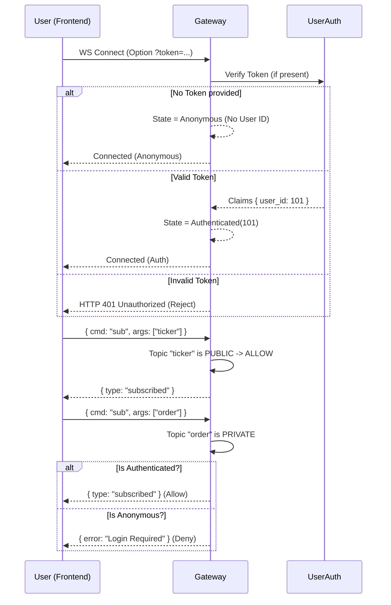

# 0x10.5 WebSocket Authentication Design

| Status | **DRAFT** |
| :--- | :--- |
| **Date** | 2025-12-27 |
| **Context** | Unblock QA Testing for Private Channels |

## 1. Problem Statement
*   **Current State**: WebSocket handler lacks an **Authentication Mechanism**. All connections are treated as **Anonymous**.
*   **Impact**: Private channels (`order.update`, `execution.report`) are unreachable because they require an **Authenticated Session**.
*   **New Capability**: Phase 0x10.6 introduced **JWT** (via `src/user_auth`). We can now use these tokens for secure identification.

## 2. Proposed Solution: JWT via Query Parameter

### 2.1 The Protocol
Since standard browser `WebSocket` API does not support custom Headers, we will use the **Query Parameter** method.

**URL Format**:
*   Authenticated: `ws://host:port/ws?token=<JWT_TOKEN>`
*   Anonymous: `ws://host:port/ws`

### 2.2 Connection Flow (Visual)



### 2.3 Channel Permission Matrix
Instead of a magic `user_id=0`, we strictly classify channels:

| Channel Type | Topics | Access Rule |
| :--- | :--- | :--- |
| **Public** | `market.ticker.*`, `market.depth.*`, `public.trade.*` | **Allow All** (Auth or Anon) |
| **Private** | `order.update`, `execution.report`, `balance.update` | **Require Authenticated** (`user_id` IS PRESENT) |

**Enforcement**:
*   `ConnectionManager` stores `user_id: Option<u64>`.
*   Subscribe Logic:
    ```rust
    match (topic_type, user_id) {
        (Public, _) => Ok(()),
        (Private, Some(_)) => Ok(()),
        (Private, None) => Err(AuthError::LoginRequired),
    }
    ```
3.  **Session Upgrade**: Connection upgrades to WebSocket.
4.  **Channel Access**:
    *   **Authenticated (Some)**: Can subscribe to Private topics (automatically) + Public topics.
    *   **Anonymous (None)**: Can ONLY subscribe to Public topics.

## 3. Implementation Plan

### 3.1 Dependencies
*   Reuse `src/user_auth` crate (verified in Phase 0x10.6).

### 3.2 Handler Logic (`src/websocket/handler.rs`)
*   **Modify `ws_handler`**:
    *   Inject `UserAuthService` or `DecodingKey` state.
    *   Parse `Query<Params>`.
    *   Perform JWT validation *before* `ws::accept`.

### 3.3 Security Considerations
*   **TLS (WSS)**: In production, `wss://` is mandatory so the Token in URL is encrypted on the wire (though visible in access logs - tolerable for short-lived sessions, or we use Ticket pattern later. For MVP, JWT in Query is acceptable).
*   **Token Expiry**: If token expires *during* connection, we can either:
    *   Ignore (session lasts as long as connection). -> **Choice for MVP**.
    *   Force disconnect.

## 4. Verification Check
*   QA to run `test_qa_adversarial.py` with specific Test Case:
    *   Connect with Valid JWT -> Verify `order.update` received.
    *   Connect with No JWT -> Verify Public Stream OK, Private Stream Silent.
    *   Connect with Fake JWT -> Verify 401.
