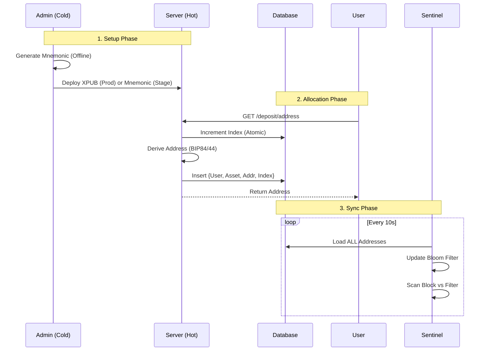

# 0x11-a Real Chain Integration

| Status | **DRAFT** |
| :--- | :--- |
| **Date** | 2025-12-28 |
| **Context** | Phase 0x11 Extension: From Mock to Reality |
| **Goal** | Integrate real Blockchain Nodes (Regtest/Testnet) and handle distributed system failures. |

## 1. Core Architecture Change: Pull vs Push

The "Mock" phase (0x11) relied on a **Push Model** (API Call -> Deposit).
Real Chain Integration (0x11-a) requires a **Pull Model** (Sentinel -> DB).

### 1.1 The Sentinel (New Service)
A dedicated, independent service loop responsible for "watching" the blockchain.

*   **Block Scanning**: Polls `getblockchaininfo` / `eth_blockNumber`.
*   **Filter**: Index `user_addresses` in memory. Scan every transaction in new blocks against this filter.
*   **State Tracking**: Updates confirmation counts for existing `CONFIRMING` deposits.

## 2. Critical Challenge: Re-org (Chain Reorganization)

In a real blockchain, the "latest" block is not final. It can be orphaned.

### 2.1 Confirmation State Machine
We must expand the Deposit Status flow to handle volatility.

| Status | Confirmations | Action | UI Display |
| :--- | :--- | :--- | :--- |
| **DETECTED** | 0 | Log Tx. Do **NOT** credit balance. | "Confirming (0/6)" |
| **CONFIRMING** | 1-5 | Update confirmation count. Check for Re-org (BlockHash mismatch). | "Confirming (N/6)" |
| **FINALIZED** | >= 6 | **Action**: Push `OrderAction::Deposit` to Pipeline. | "Success" |
| **ORPHANED** | N/A | Tx disappeared from chain. Mark as `FAILED`. | "Failed" |

### 2.2 Re-org Detection Logic
1.  Sentinel remembers `Block(Height H) = Hash A`.
2.  Sentinel scans `Height H` again later.
3.  If `Hash != A`, a Re-org happened.
4.  **Action**: Rollback scan cursor, re-evaluate all affected deposits.

## 3. Supported Chains (Phase I)

We focus "Deep & Robust" on the two archetypes:

### 3.1 Bitcoin (The UTXO Archetype)
*   **Node**: `bitcoind` (Regtest Mode).
*   **Key Challenge**: **UTXO Management**. A deposit is not a "balance update", it's a new Unspent Output. Re-orgs can invalidate specific inputs.
*   **Docker**: `ruimarinho/bitcoin-core:24`

### 3.2 Ethereum (The Account/EVM Archetype)
*   **Node**: `anvil` (from Foundry-rs).
*   **Reason**: Faster than Geth, built-in snapshot/restore, `eth_setBalance` cheats for testing.
*   **Key Challenge**: **Event Log Parsing**. ERC20 deposits are `Transfer` events in receipt logs, not native ETH transfers.
*   **Docker**: `ghcr.io/foundry-rs/foundry:latest`

## 4. Sentinel Architecture (Detailed)

The `Sentinel` service runs two parallel processes (or async tasks):

### 4.1 `BtcSentinel`
1.  `getblockhash(height)` -> `getblock(hash, 2)` (Verbosity 2 for full Tx details).
2.  Iterate inputs `vin`: Detect **Double Spends** (if we were tracking mempool).
3.  Iterate outputs `vout`: Match `scriptPubKey` against `user_addresses` (Bloom Filter or HashMap).
4.  **Re-org Check**: Keep a rolling window of last 10 block hashes. If `previousblockhash` mismatch, trigger **Rollback**.

### 4.2 `EthSentinel`
1.  `eth_getLogs` (Range: `LastScanned` to `Latest - SafeDepth`).
    *   Topic0: `Transfer(address,address,uint256)` signature.
    *   Topic2 (To): Matches our Hot Wallet or User Deposit Contracts.
2.  **Native ETH**: Must also scan block transactions for `value > 0` and `to` matches.
3.  **Re-org Check**: Check `blockHash` of confirmed logs.

## 6. Detailed Architectural Design

### 6.1 Database Schema Extensions

We need to track the "Chain Tip" state reliably to detect gaps and re-orgs.

```sql
-- Track scanning progress per chain
CREATE TABLE chain_cursor (
    chain_id VARCHAR(16) PRIMARY KEY, -- 'BTC', 'ETH'
    last_scanned_height BIGINT NOT NULL,
    last_scanned_hash VARCHAR(128) NOT NULL,
    updated_at TIMESTAMP DEFAULT CURRENT_TIMESTAMP
);

-- Enhanced Deposit History
ALTER TABLE deposit_history 
ADD COLUMN chain_id VARCHAR(16),
ADD COLUMN block_height BIGINT,
ADD COLUMN block_hash VARCHAR(128),
ADD COLUMN tx_index INT, -- Position in block
ADD COLUMN confirmations INT DEFAULT 0;

-- Index for efficient re-org checking
CREATE INDEX idx_deposit_reorg ON deposit_history(chain_id, block_height);
```

### 6.2 The `ChainScanner` Trait

We abstract the specific RPC calls behind a unified scanner interface.

```rust
#[async_trait]
pub trait ChainScanner: Send + Sync {
    // 1. Metadata
    fn chain_id(&self) -> &str;
    
    // 2. Head Check
    async fn get_latest_block_number(&self) -> Result<u64, ChainError>;
    
    // 3. Block Fetching
    async fn fetch_block(&self, height: u64) -> Result<ScannedBlock, ChainError>;
    
    // 4. Re-org Validation
    // Returns true if block at `height` still has `hash`
    async fn verify_canonical(&self, height: u64, hash: &str) -> Result<bool, ChainError>;
}

pub struct ScannedBlock {
    pub height: u64,
    pub hash: String,
    pub parent_hash: String,
    pub deposits: Vec<DetectedDeposit>,
}

pub struct DetectedDeposit {
    pub tx_hash: String,
    pub user_id: UserId,
    pub asset: String,
    pub amount: Decimal,
    pub index: u32,
}
```

### 6.3 The Sentinel Loop (Pseudocode)

```rust
loop {
    let latest = scanner.get_latest_block_number().await?;
    let cursor = db.get_cursor(scanner.chain_id()).await?;
    
    // Case 1: Gap Detected (Fast Sync)
    if latest > cursor.height {
        let next_height = cursor.height + 1;
        let block = scanner.fetch_block(next_height).await?;
        
        // RE-ORG CHECK: Does new block's parent match our cursor?
        if block.parent_hash != cursor.hash {
            warn!("Re-org detected at {}", cursor.height);
            handle_reorg(cursor.height - 1).await?;
            continue;
        }
        
        // Batch Process Deposits (Performance)
        // Avoid lock contention by inserting in chunks of 100
        for chunk in block.deposits.chunks(100) {
            db.transaction(|tx| {
                for deposit in chunk {
                    tx.insert_deposit(deposit, status="CONFIRMING");
                }
            });
        }
        
        // Atomic Cursor Update
        db.update_cursor(block.height, block.hash).await?;
        
        // Monitor Confirmations
        update_confirmations(scanner).await?;
    }
    
    sleep(Duration::from_secs(10));
}
```

### 6.4 Confirmation Monitor Logic

Separate from the scanner (or running sequentially), we must advance the state of existing deposits.

1.  Query `SELECT * FROM deposit_history WHERE status = 'CONFIRMING'`.
2.  For each deposit: `current_confs = latest_height - deposit.block_height + 1`.
3.  **Threshold Check**:
    *   **BTC**: If `confs >= 1` (Regtest) or `6` (Mainnet) -> Push `OrderAction::Deposit`.
    *   **ETH**: If `confs >= 12` -> Push `OrderAction::Deposit`.
4.  **Terminal State**: Update DB status to `SUCCESS`.

## 7. Pipeline Integration Specifics

The `Sentinel` converts `DetectedDeposit` into the engine's native language using the **Ring Buffer**:

```rust
// In src/sentinel/worker.rs
if deposit.ready_to_finalize() {
    let internal_tx = BalanceUpdate {
        user_id: deposit.user_id,
        asset: deposit.asset,
        amount: deposit.amount,
        // Unique ID ensures idempotency in Core
        trade_id: hash_to_u64(&deposit.tx_hash), 
    };
    
    logger.info("Sent deposit {} to matching engine", deposit.tx_hash);
}
```

## 7. Critical Risk: The Re-org Recovery Protocol

This is the most complex part of the system. We must handle two types of Re-orgs:

### 7.1 Shallow Re-org (Before Finalization)
*   **Scenario**: We saw Block 100 (Hash A), status `CONFIRMING`. Chain switches to Block 100 (Hash B).
*   **Impact**: The Tx in Hash A might be missing in Hash B.
*   **Resolution**:
    1.  Sentinel detects `ParentHash` mismatch at Block 101.
    2.  Sentinel walks back: 100 -> 99... until hashes match.
    3.  **DB Action**:
        *   Update `chain_cursor` to Common Ancestor (e.g., Block 99).
        *   Update `deposit_history` for re-orged blocks: Set status `ORPHANED`.
    4.  **Resume**: Sentinel scans new Block 100 (Hash B). If Tx is implicitly included, it creates a NEW row (idempotency key is `tx_hash`, so if it's the exact same Tx, we might just update metadata).
    *   *Note*: Since we never sent `OrderAction::Deposit`, the Matching Engine is unaffected. Zero financial risk.

### 7.2 Deep Re-org (After Finalization / 51% Attack)
*   **Scenario**: We credited User at Block 100 (6 confs). At Block 110, a massive re-org replaces Block 100.
*   **Impact**: User has been credited funds that no longer exist. User might have withdrawn or traded them.
*   **Resolution (The "Clawback")**:
    1.  Sentinel detects Deep Re-org (Alert Ops!).
    2.  Sentinel identifies the `SUCCESS` deposit is now invalid.
    3.  **Pipeline Action**:
        *   Inject `OrderAction::ForceDeduct` (Administrative Correction).
        *   **Reason**: "Chain Reorganization - Tx Invalidated".
    4.  **UBSCore Logic**:
        *   Deduct `amount` from `available`.
        *   **Negative Balance**: If `available < 0`, allow it to go negative.
        *   **Lockdown**: Trigger `UserAccount::freeze_all()` to prevent further trading/withdrawal until debt is settled.

| **TRON** | 20 (Prod) | 1m |

## 8. Operational Roadmap (Future Consideration)

While not part of the initial implementation, the following components are critical for a long-term production system.

### 8.1 T+1 Reconciliation Bot (The Financial Audit)

We implement a **Triangular Reconciliation Strategy** to ensure the exchange is solvent and leakage-free.

#### 8.1.1 The Equation of Truth
We must solve this equation daily:
`Delta(Liabilities) == Delta(Assets) + Fees`

To break it down:
```text
(Sum(User_End) - Sum(User_Start))  
== 
(Sum(Wallet_End) - Sum(Wallet_Start)) + (Sum(Withdrawals) - Sum(Deposits))
```

#### 8.1.2 Three-Way Match Components
1.  **Proof of Liabilities (PoL)**:
    *   `SELECT SUM(available + frozen) FROM accounts WHERE asset = 'BTC'`
2.  **Proof of Assets (PoA)**:
    *   `RPC.getbalance()` (or `listunspent` sum)
    *   *Note*: Must subtract "Unswept Dust" if we ignore it in DB.
3.  **Proof of Flow (PoF)**:
    *   `SELECT SUM(amount) FROM deposit_history WHERE status='SUCCESS' AND time > T-1`
    *   `SELECT SUM(amount + fee) FROM withdraw_history WHERE status='SUCCESS' AND time > T-1`

#### 8.1.3 The Alert Thresholds
*   **Precision**: We use `Decimal` / `u64` (Fixed Point). There is **NO** floating point error.
*   **Gas Tracking**: Every on-chain transaction (Withdrawal, Consolidation) MUST record the exact `tx_fee` in the database.
*   **Equation**: `Delta(Assets) + GasSpent == Delta(Liabilities) + NetFlow`
*   **Allowed Variance**:
    *   **Unswept Dust**: Sum of deposits < `MIN_DEPOSIT_THRESHOLD` (tracked in separate DB counter).
    *   **Nothing Else**.
*   **Action**:
    *   `Diff != Dust` -> **P0 Alert**.
    *   **Zero Tolerance** for calculation errors.
    *   If `Diff > 0`: **Suspend Withdrawals**. Call Ops.

3.  **Gas Management**: Manual gas funding for hot wallets.

## 9. Configuration & Tunables (Operational Safety)

These parameters MUST be loadable from configuration (e.g., `Settings.toml` or DB) to respond to attack vectors without recompiling.

### 9.1 The "Dust Wall" (Anti-Spam)
*   **Parameter**: `MIN_DEPOSIT_THRESHOLD` (e.g., `0.001 BTC`).
*   **Logic**:
    ```rust
    if tx.amount < config.min_deposit {
        warn!("Ignored dust deposit: {} < {}", tx.amount, config.min_deposit);
        return; // Do not track, do not insert into DB
    }
    ```
*   **Purpose**: Prevents "Dust Attacks" where consolidating inputs costs more than the deposit value.

### 9.2 The "Dead Man Switch" (Node Health)
*   **Parameter**: `MAX_BLOCK_LAG_SECONDS` (e.g., `3600`).
*   **Logic**:
    ```rust
    let block_time = block.timestamp();
    let now = SystemTime::now();
    if (now - block_time) > config.max_block_lag {
        error!("CRITICAL: Node is stale! Block time: {}, Lag: {}s", block_time, lag);
        std::process::exit(1); // Force Crash & Alert
    }
    ```
*   **Purpose**: Prevents Sentinel from scanning a stale local chain while the real world has moved on.

    }
    ```
*   **Purpose**: Prevents Sentinel from scanning a stale local chain while the real world has moved on.

## 10. Wallet & Address Management (HD Architecture)

To ensure security, we strictly follow the **Watch-Only Wallet** pattern using BIP32/BIP44/BIP84 standards.

### 10.1 The Master Key (Cold Storage)
*   **Generation**: Created offline (Air-gapped) or via Hardware Wallet (Ledger/Trezor).
*   **Export**: Only the **Extended Public Key (`xpub`/`zpub`)** is exported to the production server.
*   **Security Guarantee**: Even if the entire DB and Sentinel are compromised, **attackers cannot steal funds** (they can't sign withdrawals).

### 10.2 Address Derivation (Hot Allocation)
*   **Path Standard**:
    *   BTC (Segwit): `m/84'/0'/0'/0/{index}` (BIP84)
    *   ETH: `m/44'/60'/0'/0/{index}` (BIP44)
*   **Allocation Logic**:
    1.  User requests `GET /deposit/address`.
    2.  DB: Atomic Increment `address_index` for the Chain.
    3.  Service: Derive address from `xpub` at new `index`.
    4.  DB: Store mapping `user_id <-> address <-> index`.

### 10.3 Wallet Lifecycle Diagram



### 10.4 The "Gap Limit" Problem
*   **Issue**: HD Wallets usually stop scanning if they see 20 unused addresses. We allocate addresses randomly to users.
*   **Solution**: **Full Index Scanning**.
    *   The Sentinel does NOT rely on Gap Limits.
    *   The Sentinel loads **ALL** active allocated addresses from the `user_addresses` table into a **Bloom Filter** or **HashSet**.
    *   When scanning a block, it checks every output against this Set.
    *   *Scale*: A Rust `HashSet` of 10 million addresses consumes ~300MB RAM. Totally acceptable for Phase I-III.

### 10.4 Key Rotation
*   **Scenario**: The cold key is compromised or we want to migrate.
*   **Action**:
    1.  Admin configures new `xpub_v2`.
    2.  New users get addresses from `xpub_v2`.
    3.  Sentinel scans **BOTH** `xpub_v1` addresses and `xpub_v2` addresses.

### 10.5 Security Guards
*   **Rate Limiting**: `GET /deposit/address` must be rate-limited (e.g., 10/min per user) to prevent **Address Poisoning** (bloating our scan index).
*   **Sanity Check**: Reject derivation if `index > max_allowed_index` (e.g., 10 million).

## 11. Advanced Defense (The "Fake Re-org")
*   **Risk**: Attacker compromises the local Bitcoin Node and feeds fake blocks.
*   **Defense**: **Multi-Source Validation** (Phase II).
    *   Before "Finalizing" any deposit > 1 BTC, Sentinel must verify the Block Hash against a secondary, trusted source (e.g., Blockstream API / Infura).
    *   *Note*: Optional for Regtest/Phase I, Mandatory for Mainnet.

