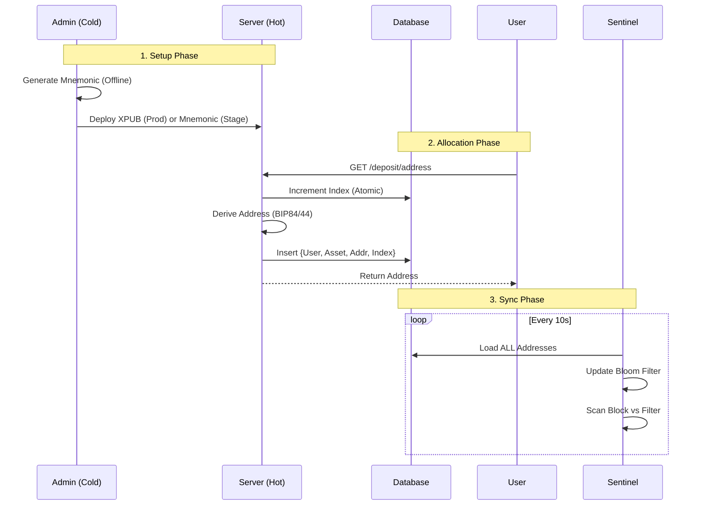

# 0x11-a Real Chain Integration

<h3>
  <a href="#-english">🇺🇸 English</a>
  &nbsp;&nbsp;&nbsp;|&nbsp;&nbsp;&nbsp;
  <a href="#-chinese">🇨🇳 中文</a>
</h3>

<div id="-english"></div>

## 🇺🇸 English

| Status | 🚧 **CONSTRUCTION** (Detailed Design Phase) |
| :--- | :--- |
| **Date** | 2025-12-28 |
| **Context** | Phase 0x11 Extension: From Mock to Reality |
| **Goal** | Integrate real Blockchain Nodes (Regtest/Testnet) and handle distributed system failures (Re-orgs, Network Partition). |

---

## 1. Core Architecture Change: Pull vs Push

The "Mock" phase (0x11) relied on a **Push Model** (API Call -> Deposit).
Real Chain Integration (0x11-a) requires a **Pull Model** (Sentinel -> DB).

### 1.1 The Sentinel (New Service)
A dedicated, independent service loop responsible for "watching" the blockchain.

*   **Block Scanning**: Polls `getblockchaininfo` / `eth_blockNumber`.
*   **Filter**: Index `user_addresses` in memory. Scan every transaction in new blocks against this filter.
*   **State Tracking**: Updates confirmation counts for existing `CONFIRMING` deposits.

## 2. Critical Challenge: Re-org (Chain Reorganization)

In a real blockchain, the "latest" block is not final. It can be orphaned.

### 2.1 Confirmation State Machine
We must expand the Deposit Status flow to handle volatility.

| Status | Confirmations | Action | UI Display |
| :--- | :--- | :--- | :--- |
| **DETECTED** | 0 | Log Tx. Do **NOT** credit balance. | "Confirming (0/X)" |
| **CONFIRMING** | 1 to (X-1) | Update confirmation count. Check for Re-org (BlockHash mismatch). | "Confirming (N/X)" |
| **FINALIZED** | >= X | **Action**: Push `OrderAction::Deposit` to Pipeline. | "Success" |

> [!IMPORTANT]
> **X** represents the `REQUIRED_CONFIRMATIONS` parameter, which **MUST** be configured individually for each chain (e.g., BTC, ETH, SOL) based on their specific finality characteristics. Hardcoding these values is strictly forbidden.

### 2.2 Re-org Detection Logic
1.  Sentinel remembers `Block(Height H) = Hash A`.
2.  Sentinel scans `Height H` again later.
3.  If `Hash != A`, a Re-org happened.
4.  **Action**: Rollback scan cursor, re-evaluate all affected deposits.

## 3. Supported Chains (Phase I)

We focus "Deep & Robust" on the two archetypes:

### 3.1 Bitcoin (The UTXO Archetype)
*   **Node**: `bitcoind` (Regtest Mode).
*   **Key Challenge**: **UTXO Management**. A deposit is not a "balance update", it's a new Unspent Output. Re-orgs can invalidate specific inputs.
*   **Docker**: `ruimarinho/bitcoin-core:24`

### 3.2 Ethereum (The Account/EVM Archetype)
*   **Node**: `anvil` (from Foundry-rs).
*   **Reason**: Faster than Geth, built-in snapshot/restore, `eth_setBalance` cheats for testing.
*   **Key Challenge**: **Event Log Parsing**. ERC20 deposits are `Transfer` events in receipt logs, not native ETH transfers.
*   **Docker**: `ghcr.io/foundry-rs/foundry:latest`

## 4. Sentinel Architecture (Detailed)

The `Sentinel` service runs two parallel processes (or async tasks):

### 4.1 `BtcSentinel`
1.  `getblockhash(height)` -> `getblock(hash, 2)` (Verbosity 2 for full Tx details).
2.  Iterate inputs `vin`: Detect **Double Spends** (if we were tracking mempool).
3.  Iterate outputs `vout`: Match `scriptPubKey` against `user_addresses` (Bloom Filter or HashMap).
4.  **Re-org Check**: Keep a rolling window of last 10 block hashes. If `previousblockhash` mismatch, trigger **Rollback**.

### 4.2 `EthSentinel`
1.  `eth_getLogs` (Range: `LastScanned` to `Latest - SafeDepth`).
    *   Topic0: `Transfer(address,address,uint256)` signature.
    *   Topic2 (To): Matches our Hot Wallet or User Deposit Contracts.
2.  **Native ETH**: Must also scan block transactions for `value > 0` and `to` matches.
3.  **Re-org Check**: Check `blockHash` of confirmed logs.

## 5. Reconciliation & Safety (The Financial Firewall)

### 5.1 The "Truncation Protocol" (100% Match)
To solve the "Floating Point Curse" on-chain:

*   **Precision Constraint**: The system supports `N` decimals as defined in **Asset Configuration** (e.g., `ETH`=12 or 18).
*   **Ingress Logic**:
    *   `Deposit_Credited = Truncate(Deposit_Raw, Configured_Precision)`
    *   *Residue*: `Deposit_Raw - Deposit_Credited` remains in the wallet as "System Dust".
*   **Reconciliation Equation**:
    ```text
    Truncate(Wallet_Start + Deposits - Withdrawals - GasFees, N) 
    == 
    Sum(User_Balances)
    ```
*   **Alerting**: **Zero Tolerance**. Any deviation triggers **P0 Alert** and suspends withdrawals.

### 5.2 Re-org Recovery Protocol
We must handle two types of Re-orgs:

#### 5.2.1 Shallow Re-org (Before Finalization)
*   **Scenario**: Block 100 (Hash A) -> Block 100 (Hash B).
*   **Action**: Sentinel detects hash mismatch, rolls back `chain_cursor`, and marks orphaned deposits as `ORPHANED`. No user balance impact.

#### 5.2.2 Deep Re-org (The "Clawback")
*   **Scenario**: User credited after `REQUIRED_CONFIRMATIONS`, but chain re-orgs deeper than `MAX_REORG_DEPTH` (51% attack/network split).
*   **Action**:
    1.  Sentinel detects deep re-org.
    2.  Engine injects `OrderAction::ForceDeduct` (Administrative Correction).
    3.  User balance might go negative. Account frozen until settled.

## 6. Detailed Architectural Design

### 6.1 Database Schema Extensions

We need to track the "Chain Tip" state reliably to detect gaps and re-orgs.

```sql
-- Track scanning progress per chain
CREATE TABLE chain_cursor (
    chain_id VARCHAR(16) PRIMARY KEY, -- 'BTC', 'ETH'
    last_scanned_height BIGINT NOT NULL,
    last_scanned_hash VARCHAR(128) NOT NULL,
    updated_at TIMESTAMP DEFAULT CURRENT_TIMESTAMP
);

-- Enhanced Deposit History
ALTER TABLE deposit_history 
ADD COLUMN chain_id VARCHAR(16),
ADD COLUMN block_height BIGINT,
ADD COLUMN block_hash VARCHAR(128),
ADD COLUMN tx_index INT, -- Position in block
ADD COLUMN confirmations INT DEFAULT 0;

-- Index for efficient re-org checking
CREATE INDEX idx_deposit_reorg ON deposit_history(chain_id, block_height);
```

### 6.2 The `ChainScanner` Trait

We abstract the specific RPC calls behind a unified scanner interface.

```rust
#[async_trait]
pub trait ChainScanner: Send + Sync {
    // 1. Metadata
    fn chain_id(&self) -> &str;
    
    // 2. Head Check
    async fn get_latest_block_number(&self) -> Result<u64, ChainError>;
    
    // 3. Block Fetching
    async fn fetch_block(&self, height: u64) -> Result<ScannedBlock, ChainError>;
    
    // 4. Re-org Validation
    // Returns true if block at `height` still has `hash`
    async fn verify_canonical(&self, height: u64, hash: &str) -> Result<bool, ChainError>;
}

pub struct ScannedBlock {
    pub height: u64,
    pub hash: String,
    pub parent_hash: String,
    pub deposits: Vec<DetectedDeposit>,
}

pub struct DetectedDeposit {
    pub tx_hash: String,
    pub user_id: UserId,
    pub asset: String,
    pub amount: Decimal,
    pub index: u32,
}
```

### 6.3 The Sentinel Loop (Architecture Policy)

The Sentinel MUST follow the **Atomic Check-and-Update** pattern to prevent double-processing:

1.  **Cursor Check**: Fetch `(height, hash)` from `chain_cursor`.
2.  **Parent Validation**: If `new_block.parent_hash != cursor.hash` -> **TRIGGER RE-ORG PROTOCOL**.
3.  **Scalable Scanning**:
    *   Perform exact lookup in `user_addresses` HashMap for detected block outputs. (Bloom Filter optimization moved to future work).
4.  **Deterministic Injection**:
    *   `FINALIZED` deposits are converted to `OrderAction::Deposit`.
    *   A unique `ref_id` (e.g., `hash_to_u64(tx_hash)`) is used for Core-level idempotency.
5.  **Atomic Commit**: `INSERT deposit_history` + `UPDATE chain_cursor` in a single SQL transaction.

### 6.4 The Triangular Reconciliation Strategy

We verify system solvency daily through three independent data sources:

| Source | Component | Data Point |
| :--- | :--- | :--- |
| **Blockchain (PoA)** | Proof of Assets | `RPC.getbalance()` |
| **Ledger (PoL)** | Proof of Liabilities | `SUM(accounts.balance)` |
| **History (PoF)** | Proof of Flow | `SUM(deposits) - SUM(withdrawals) - Fees` |

**The Equation of Truth**:  
`PoA == PoL + System_Profit`

Any breach of this equation (Delta > 0) will trigger a **Circuit Breaker** (suspending all withdrawals).

## 7. Re-org Recovery (Shallow)

Sentinel handles shallow re-orgs by rolling back the `chain_cursor` to the last known canonical height.

## 8. Future Work & Recommendations (Out of Scope for 0x11-a)

### 8.1 Advanced Performance: Bloom Filters
Load million-user addresses into a Bloom Filter for O(1) transaction pre-checking.

### 8.2 Deep Re-org Recovery: Automated Clawback
While shallow re-orgs are handled by cursor rollback, a **Deep Re-org (Depth > 10)** currently requires manual audit. Future implementation will include:
1.  **Freeze**: Automatic `SystemControl::FreezeWithdrawals`.
2.  **Clawback**: Deterministic `ForceDeduct` for invalidated deposits.

### 6.4 Confirmation Monitor Logic

Separate from the scanner (or running sequentially), we must advance the state of existing deposits.

1.  Query `SELECT * FROM deposit_history WHERE status = 'CONFIRMING'`.
2.  For each deposit: `current_confs = latest_height - deposit.block_height + 1`.
3.  **Threshold Check**:
    *   Compare `current_confs` against the chain-specific `REQUIRED_CONFIRMATIONS` configuration.
    *   If `current_confs >= config.required_confirmations` -> Push `OrderAction::Deposit`.
4.  **Terminal State**: Update DB status to `SUCCESS`.

## 7. Pipeline Integration Specifics

The `Sentinel` converts `DetectedDeposit` into the engine's native language using the **Ring Buffer**:

```rust
// In src/sentinel/worker.rs
if deposit.ready_to_finalize() {
    let internal_tx = BalanceUpdate {
        user_id: deposit.user_id,
        asset: deposit.asset,
        amount: deposit.amount,
        // Unique ID ensures idempotency in Core
        trade_id: hash_to_u64(&deposit.tx_hash), 
    };
    
    logger.info("Sent deposit {} to matching engine", deposit.tx_hash);
}
```

## 8. Operational Roadmap (Future Consideration)

### 8.1 T+1 Reconciliation Bot (The Financial Audit)

We implement a **Triangular Reconciliation Strategy** to ensure the exchange is solvent and leakage-free.

#### 8.1.1 The Equation of Truth
We must solve this equation daily:
`Delta(Liabilities) == Delta(Assets) + Fees`

To break it down:
```text
(Sum(User_End) - Sum(User_Start))  
== 
(Sum(Wallet_End) - Sum(Wallet_Start)) + (Sum(Withdrawals) - Sum(Deposits))
```

#### 8.1.2 Three-Way Match Components
1.  **Proof of Liabilities (PoL)**:
    *   `SELECT SUM(available + frozen) FROM accounts WHERE asset = 'BTC'`
2.  **Proof of Assets (PoA)**:
    *   `RPC.getbalance()` (or `listunspent` sum)
3.  **Proof of Flow (PoF)**:
    *   `SELECT SUM(amount) FROM deposit_history WHERE status='SUCCESS' AND time > T-1`
    *   `SELECT SUM(amount + fee) FROM withdraw_history WHERE status='SUCCESS' AND time > T-1`

## 9. Configuration & Tunables (Operational Safety)

### 9.1 The "Dust Wall" (Anti-Spam)
*   **Parameter**: `MIN_DEPOSIT_THRESHOLD` (e.g., set per-asset).
*   **Purpose**: Prevents "Dust Attacks" where consolidating inputs costs more than the deposit value.

### 9.2 The "Dead Man Switch" (Node Health)
*   **Parameter**: `MAX_BLOCK_LAG_SECONDS` (e.g., set based on expected block time).
*   **Purpose**: Prevents Sentinel from scanning a stale local chain while the real world has moved on.

## 10. Wallet & Address Management (HD Architecture)

To ensure security, we strictly follow the **Watch-Only Wallet** pattern using BIP32/BIP44/BIP84 standards.

### 10.1 The Master Key (Cold Storage)
*   **Export**: Only the **Extended Public Key (`xpub`/`zpub`)** is exported to the production server.
*   **Security Guarantee**: Even if the entire DB and Sentinel are compromised, **attackers cannot steal funds**.

### 10.2 Address Derivation (Hot Allocation)
*   **Path Standard**:
    *   BTC (Segwit): `m/84'/0'/0'/0/{index}` (BIP84)
    *   ETH: `m/44'/60'/0'/0/{index}` (BIP44)
*   **Allocation Logic**:
    1.  User requests `GET /deposit/address`.
    2.  DB: Atomic Increment `address_index` for the Chain.
    3.  Service: Derive address from `xpub` at new `index`.
    4.  DB: Store mapping `user_id <-> address <-> index`.

### 10.3 Wallet Lifecycle Diagram



### 10.4 The "Gap Limit" Solution
*   **Solution**: **Full Index Scanning**. Sentinel loads **ALL** active allocated addresses from the `user_addresses` table into a **Bloom Filter**.

---

<br>
<div align="right"><a href="#-english">↑ Back to Top</a></div>
<br>

---

<div id="-chinese"></div>

## 🇨🇳 中文

| 状态 | 🚧 **设计阶段** |
| :--- | :--- |
| **日期** | 2025-12-28 |
| **上下文** | Phase 0x11 扩展: 从模拟到现实 |
| **目标** | 集成真实区块链节点 (Regtest/Testnet) 并处理分布式系统故障 (重组, 网络分区)。 |

---

## 1. 核心架构变更: Pull vs Push

Mock 阶段 (0x11) 依赖 **Push 模型** (API 调用 -> 充值)。
真实链集成 (0x11-a) 需要 **Pull 模型** (哨兵 -> 数据库)。

### 1.1 哨兵服务 (Sentinel)
一个独立的、死循环的服务，负责 "注视" 区块链。

*   **区块扫描**: 轮询 `getblockchaininfo` / `eth_blockNumber`。
*   **过滤器**: 内存中索引所有 `user_addresses`。
*   **状态追踪**: 更新 `CONFIRMING` 状态存款的确认数。

## 2. 支持链 (第一阶段)

### 2.1 Bitcoin (UTXO 原型)
*   **节点**: `bitcoind` (Regtest 模式)。
*   **挑战**: **UTXO 管理**。存款是新的 UTXO，而不是余额数字更新。
*   **Docker**: `ruimarinho/bitcoin-core:24`

### 2.2 Ethereum (账户/EVM 原型)
*   **节点**: `anvil` (Foundry-rs)。
*   **挑战**: **Event Log 解析**。ERC20 存款是 Log 中的 `Transfer` 事件。
*   **Docker**: `ghcr.io/foundry-rs/foundry:latest`

---

## 3. 对账与安全 (金融防火墙)

### 3.1 "截断协议" (100% 匹配)
解决链上浮点数问题：

*   **精度约束**: 系统仅支持配置定义的 `N` 位小数 (如 ETH=12)。
*   **入金逻辑**: `入账金额 = Truncate(链上原始金额, N)`。
*   **对账公式**:
    ```text
    Truncate(钱包初始 + 充值 - 提现 - Gas费, N) 
    == 
    Sum(用户余额)
    ```
*   **报警**: **零容忍**。任何偏差触发 P0 报警并暂停提现。

### 3.2 重组恢复协议 (Re-org Recovery)

#### 3.2.1 浅层重组 (Finalization 之前)
*   **场景**: 区块 100 (Hash A) 变为 (Hash B)。
*   **动作**: 哨兵发现 Hash 不匹配，回滚 `chain_cursor`，标记孤块存款为 `ORPHANED`。不影响用户余额。

#### 3.2.2 深层重组 ("回撤" Clawback)
*   **场景**: 确认数达到 `REQUIRED_CONFIRMATIONS` 后入账，但链发生超过 `MAX_REORG_DEPTH` 的深层重组。
*   **动作**:
    1.  哨兵检测到深层重组。
    2.  引擎注入 `OrderAction::ForceDeduct` (行政冲正)。
    3.  用户余额可能变为负数。账户冻结直至平账。

---

## 4. 钱包架构 (温/冷)

### 4.1 地址派生
*   **标准**: BIP32/BIP44/BIP84。
*   **模式**: **Watch-Only** (只读)。
    *   服务器仅持有 **扩展公钥 (`xpub`)**。
    *   私钥保持离线 (冷存储)。

### 4.2 "Gap Limit" 解决方案
*   **问题**: HD 钱包通常在遇到 20 个未使用地址后停止扫描。
*   **方案**: **全索引扫描**。
    *   哨兵将 **所有** 已分配地址加载到 **Bloom Filter**。
    *   扫描每个区块的所有输出，忽略 Gap Limit。

---

<br>
<div align="right"><a href="#-chinese">↑ 回到顶部</a></div>
<br>
