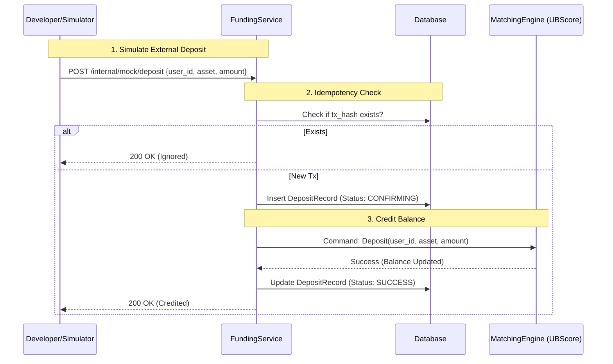
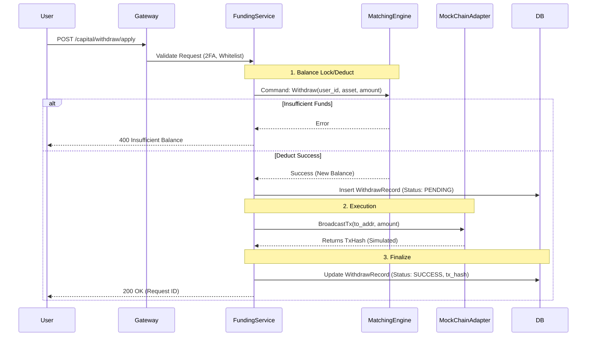

# 0x11 Deposit & Withdraw Architecture

| Status | **DRAFT** |
| :--- | :--- |
| **Date** | 2025-12-28 |
| **Context** | P1 Feature: Asset Inflow/Outflow |
| **Reviewers** | PM, Architect, Security Expert |
| **Deliverables** | [📄 Strict Acceptance Checklist](./0x11-acceptance-checklist.md) |

## 1. Product Manager View (Business Logic & UX)

### 1.1 User Stories
1.  **Deposit**: "I want to see a permanent deposit address for USDT. When I send funds, I want to be notified after 1 confirmation and credited after 3 confirmations."
2.  **Withdraw**: "I want to withdraw assets to my external wallet. I expect a fee deduction and a status tracker."
3.  **Admin**: "I need to see a dashboard of all pending withdrawals to manually approve large sums."

### 1.2 Status Definitions
*   **Deposit**:
    *   `Detected`: Seen in mempool (Optional for MVP).
    *   `Confirming`: Mined, waiting for block confirmations (e.g., 6 blocks).
    *   `Success`: Balance credited.
*   **Withdrawal**:
    *   `Submitted`: Request received.
    *   `Auditing`: Internal risk check (or Manual Review).
    *   `Processing`: Signed and broadcasting.
    *   `Success`: On-chain confirmed.
    *   `Failed`: Rejected or Reverted.

### 1.3 Business Rules (MVP)
*   **Supported Assets**: 
    *   **ETH** (Account Model, Hex Address).
    *   **BTC** (UTXO Model, Base58/Bech32 Address).
*   **Strategy**: **Simulation Mode** (Mock Chain) for fast iteration.

---

## 2. Technical Architect View (System Design)

### 2.1 Process Logic & Flowcharts

### 2.1.1 Deposit Flow (Mock Simulation)
Since we are using **Mock Chain** for MVP, the "Deposit" is triggered by a Debug API or a Background Simulator, simulating a scanner detecting an on-chain event.

### 2.1.2 Withdraw Flow
User initiates withdrawal. System performs risk checks and simulates broadcast.

### 2.2 Integration Strategy: "The Multi-Chain Mock"
To avoid reliance on expensive/flakey Testnets:
*   **Interface**: `ChainClient` trait with `simulate_block()`.
*   **Implementation**: 
    *   `MockEvmChain`: Handles ETH/ERC20 (Hex Addr, Nonce).
    *   **`MockBtcChain`**: Handles BTC (Base58 Addr, UTXO concept simplified).
    *   **Deposit**: Dev calls `POST /debug/deposit { chain: "BTC", tx_hash, amount }`.
    *   **Withdraw**: System logs "Broadcasting BTC Tx..." and returns fake TxHash.

### 2.3 Database Schema (PostgreSQL)

**`deposit_history`**
*   `tx_hash` (PK): Unique Idempotency Key.
*   `user_id`, `asset`, `amount`.
*   `status`: (Confirming, Success).
*   `block_height`: For re-org handling.

**`withdraw_history`**
*   `request_id` (PK): UUID.
*   `user_id`, `asset`, `amount`, `fee`.
*   `tx_hash`: Populated after broadcast.
*   `status`.

**`user_addresses`**
*   `user_id`, `asset`, `address`.

---

## 3. Security Expert View (Risk Control)

### 3.1 Address Management - "The Warm Wallet Model"
*   **User Deposit Address**: generated per user. Keys **NOT** stored in Hot DB (ideally).
*   **Sweeping (Aggregation)**:
    *   Funds sent to User Address are **Swept** to a Central Hot Wallet periodically.
    *   *MVP Simplification*: Mock Scanner assumes funds are available.

### 3.2 Withdrawal Risk Checks
1.  **Balance Check**: Atomic check against User Balance (UBScore).
2.  **2FA**: Mandatory (TOTP) for withdrawal requests (Phase 0x12).
3.  **Idempotency**: `request_id` prevents double-withdrawals on network retries.

### 3.3 Critical Risks & Mitigations
| Risk | Mitigation |
| :--- | :--- |
| **False Deposit** (Faking Tx) | Scanner must verify Tx against its own node/RPC, never trust client input. |
| **Replay Attack** | Use `nonce` on-chain. Track `tx_hash` in DB unique index. |
| **Re-org** | Do not credit balance until SAFE confirmations (e.g., 6 blocks). |
| **Hot Wallet Compromise** | Limit Hot Wallet balance. Most funds in Cold Storage. |

---

## 4. Implementation Steps (Phase 0x11)
1.  **Chain Adapter**: Implement `MockChain` trait.
2.  **Service Layer**: `FundingService` (Address Gen, History Read).
3.  **Deposit Flow**: Debug API -> Scanner -> Credit Balance.
4.  **Withdraw Flow**: User API -> Risk Check -> Mock Broadcast.
