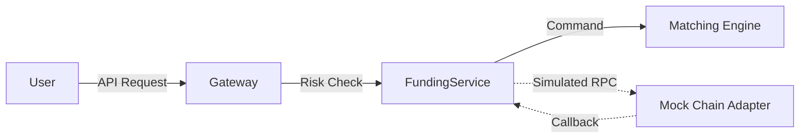
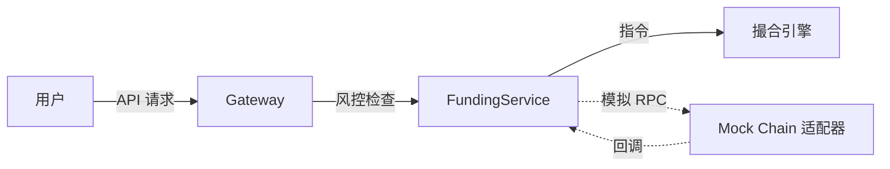

# 0x11 Deposit & Withdraw (Mock Chain)

<h3>
  <a href="#-english">🇺🇸 English</a>
  &nbsp;&nbsp;&nbsp;|&nbsp;&nbsp;&nbsp;
  <a href="#-chinese">🇨🇳 中文</a>
</h3>

<div id="-english"></div>

## 🇺🇸 English

> **📦 Code Changes**: [View Diff](https://github.com/gjwang/zero_x_infinity/compare/v0.10-web-frontend...v0.11-deposit-withdraw)

> **Core Objective**: Implement the **Funding Layer** (Deposit & Withdraw) using a **Mock Chain Architecture** to validate asset flows without external blockchain dependencies.

---

## 1. Background & Architecture

We have a high-performance **Matching Engine** (Phase I) and a **Product Layer** (Accounts/Auth, Phase II).
Now we add the **Funding Layer** to allow assets to enter and leave the system.

### 1.1 The "Mock Chain" Strategy
Instead of syncing 500GB of Bitcoin data, we implement a **Simulator** for Phase 0x11.

*   **Goal**: Validate internal logic (Balance Credit, Risk Check, Idempotency).
*   **Method**: `MockBtcChain` and `MockEvmChain` traits that simulate RPC calls.



### 1.2 Phase Plan

| Chapter | Topic | Status |
|---------|-------|--------|
| **0x11** | **Deposit & Withdraw (Mock)** | ✅ **Completed** |
| 0x11-a | Real Chain Integration | 🚧 Construction |

---

## 2. Core Implementation

### 2.1 Funding Service (`src/funding/service.rs`)
The central orchestrator for all funding operations.

*   **Deposit**: Receives "Mock Event", checks idempotency, credits user balance via matching engine.
*   **Withdraw**: Authenticates user, locks funds in engine, simulates broadcast, updates DB.

### 2.2 Chain Adapter Trait (`src/funding/chain_adapter.rs`)
We abstract blockchain specifics behind a trait:

```rust
#[async_trait]
pub trait ChainClient: Send + Sync {
    async fn generate_address(&self, user_id: i64) -> Result<String, ChainError>;
    async fn broadcast_withdraw(&self, to: &str, amount: &str) -> Result<String, ChainError>;
    // ... validation methods
}
```

### 2.3 Database Schema (Migration)
Key tables added in `migrations/010_deposit_withdraw.sql`:
*   `deposit_history`: Tracks incoming transactions (Key: `tx_hash`).
*   `withdraw_history`: Tracks outgoing requests (Key: `request_id`).
*   `user_addresses`: Maps `User <-> Asset <-> Address`.

---

## 3. Data Flow

### 3.1 Deposit Flow (Mock)

1.  **Trigger**: `POST /internal/mock/deposit { user_id, asset, amount }`
2.  **Idempotency**: Check if `tx_hash` exists in `deposit_history`.
3.  **Engine Execution**: Send `OrderAction::Deposit` to Match Engine.
4.  **Result**: User Balance increases.

```rust
// src/funding/deposit.rs
pub async fn process_deposit(...) {
    if db.exists(tx_hash).await? { return Ok(()); }
    
    // Command Engine
    engine.execute(Deposit(user_id, asset, amount)).await?;
    
    // Persist
    db.insert_deposit(..., "SUCCESS").await?;
}
```

### 3.2 Withdraw Flow

1.  **Request**: `POST /api/v1/private/withdraw/apply`
2.  **Risk Check**: 2FA (Future), Whitelist, **Balance Check**.
3.  **Engine Lock**: Send `OrderAction::WithdrawLock` (Instant deduction).
4.  **Broadcast**: Call `mock_chain.broadcast()`.
5.  **Finalize**: Update `withdraw_history` with `tx_hash`.

---

## 4. Verification

We verified this phase using a comprehensive E2E script.

### 4.1 Verification Script
Run the master script to verify the full lifecycle:
```bash
./scripts/verify_funding_trading_flow.sh
```

**Scenario Covered**:
1.  **Register** User A & B.
2.  **Deposit** BTC to User A (Mock).
3.  **Transfer** internal funds.
4.  **Trade** (Buy/Sell) to change balances.
5.  **Withdraw** USDT from User B.
6.  **Audit**: Check DB consistency.

### 4.2 Security Validation
*   **Address Validation**: Strict Regex for `0x...` (ETH) and `1/3/bc1...` (BTC).
*   **Internal Auth**: Mock endpoints protected by `X-Internal-Secret`.

---

## Summary

Phase 0x11 establishes the "Financial Highways" of the exchange.
By using a **Mock Chain**, we isolated the complex internal logic (Accounting, Risk, Idempotency) from the external chaos of real blockchains.

**Key Achievement**:
> A complete, idempotent Asset Inflow/Outflow system that is "Blockchain Agnostic".

**Next Step**:
> **Phase 0x11-a**: Replace the "Mock Adapter" with a "Real Node Sentinel" (Bitcoin Core / Anvil).

<br>
<div align="right"><a href="#-english">↑ Back to Top</a></div>
<br>

---

<div id="-chinese"></div>

## 🇨🇳 中文

> **📦 代码变更**: [查看 Diff](https://github.com/gjwang/zero_x_infinity/compare/v0.10-web-frontend...v0.11-deposit-withdraw)

> **核心目标**：实现 **资金层 (Funding Layer)** (充值与提现)，使用 **模拟链架构 (Mock Chain)** 来验证资金流转，而不依赖外部区块链环境。

---

## 1. 背景与架构

我们已经拥有了高性能的 **撮合引擎** (Phase I) 和 **产品层** (账户/鉴权, Phase II)。
现在我们需要添加 **资金层**，允许资产进入和离开系统。

### 1.1 "Mock Chain" 策略
在 Phase 0x11 中，我们实现一个 **模拟器**，而不是直接同步 500GB 的比特币数据。

*   **目标**: 验证内部逻辑 (余额入账、风控检查、幂等性)。
*   **方法**: `MockBtcChain` 和 `MockEvmChain` trait，模拟 RPC 调用。



### 1.2 阶段规划

| 章节 | 主题 | 状态 |
|------|------|------|
| **0x11** | **充值与提现 (Mock)** | ✅ **已完成** |
| 0x11-a | 真实链集成 | 🚧 建设中 |

---

## 2. 核心实现

### 2.1 资金服务 (`src/funding/service.rs`)
资金操作的核心协调器。

*   **充值 (Deposit)**: 接收 "模拟事件"，检查幂等性，通过撮合引擎增加用户余额。
*   **提现 (Withdraw)**: 验证用户，锁定引擎中的资金，模拟广播，更新数据库。

### 2.2 链适配器接口 (`src/funding/chain_adapter.rs`)
我们将区块链细节抽象在 Trait 之后：

```rust
#[async_trait]
pub trait ChainClient: Send + Sync {
    async fn generate_address(&self, user_id: i64) -> Result<String, ChainError>;
    async fn broadcast_withdraw(&self, to: &str, amount: &str) -> Result<String, ChainError>;
    // ... 验证方法
}
```

### 2.3 数据库 Schema (Migration)
`migrations/010_deposit_withdraw.sql` 新增的关键表：
*   `deposit_history`: 追踪入金 (Key: `tx_hash`)。
*   `withdraw_history`: 追踪出金 (Key: `request_id`)。
*   `user_addresses`: 映射 `User <-> Asset <-> Address`。

---

## 3. 数据流

### 3.1 充值流程 (Mock)

1.  **触发**: `POST /internal/mock/deposit { user_id, asset, amount }`
2.  **幂等性**: 检查 `deposit_history` 中是否存在 `tx_hash`。
3.  **引擎执行**: 发送 `OrderAction::Deposit` 给撮合引擎。
4.  **结果**: 用户余额增加。

```rust
// src/funding/deposit.rs
pub async fn process_deposit(...) {
    if db.exists(tx_hash).await? { return Ok(()); }
    
    // Command Engine
    engine.execute(Deposit(user_id, asset, amount)).await?;
    
    // Persist
    db.insert_deposit(..., "SUCCESS").await?;
}
```

### 3.2 提现流程

1.  **请求**: `POST /api/v1/private/withdraw/apply`
2.  **风控**: 2FA (规划中), 白名单, **余额检查**。
3.  **引擎锁定**: 发送 `OrderAction::WithdrawLock` (瞬间扣除)。
4.  **广播**: 调用 `mock_chain.broadcast()`。
5.  **终结**: 更新 `withdraw_history` 填充 `tx_hash`。

---

## 4. 验证与测试

我们使用全链路 E2E 脚本验证了本阶段功能。

### 4.1 验证脚本
运行主脚本以验证完整生命周期：
```bash
./scripts/verify_funding_trading_flow.sh
```

**覆盖场景**:
1.  **注册** 用户 A & B。
2.  **充值** BTC 给用户 A (模拟)。
3.  **划转** 资金 (Internal Transfer)。
4.  **交易** (买/卖) 改变余额。
5.  **提现** USDT (用户 B)。
6.  **审计**: 检查数据库一致性。

### 4.2 安全性验证
*   **地址验证**: 针对 `0x...` (ETH) 和 `1/3/bc1...` (BTC) 的严格正则校验。
*   **内部鉴权**: Mock 端点受 `X-Internal-Secret` 保护。

---

## 总结

Phase 0x11 建立了交易所的 "资金高速公路"。
通过使用 **Mock Chain**，我们将复杂的内部逻辑（会计、风控、幂等性）与外部区块链的混乱隔离开来。

**关键成就**:
> 一套完整的、幂等的资产流入/流出系统，且做到 "Blockchain Agnostic" (与具体链解耦)。

**下一步**:
> **Phase 0x11-a**: 将 "Mock Adapter" 替换为 "Real Node Sentinel" (Bitcoin Core / Anvil)。
