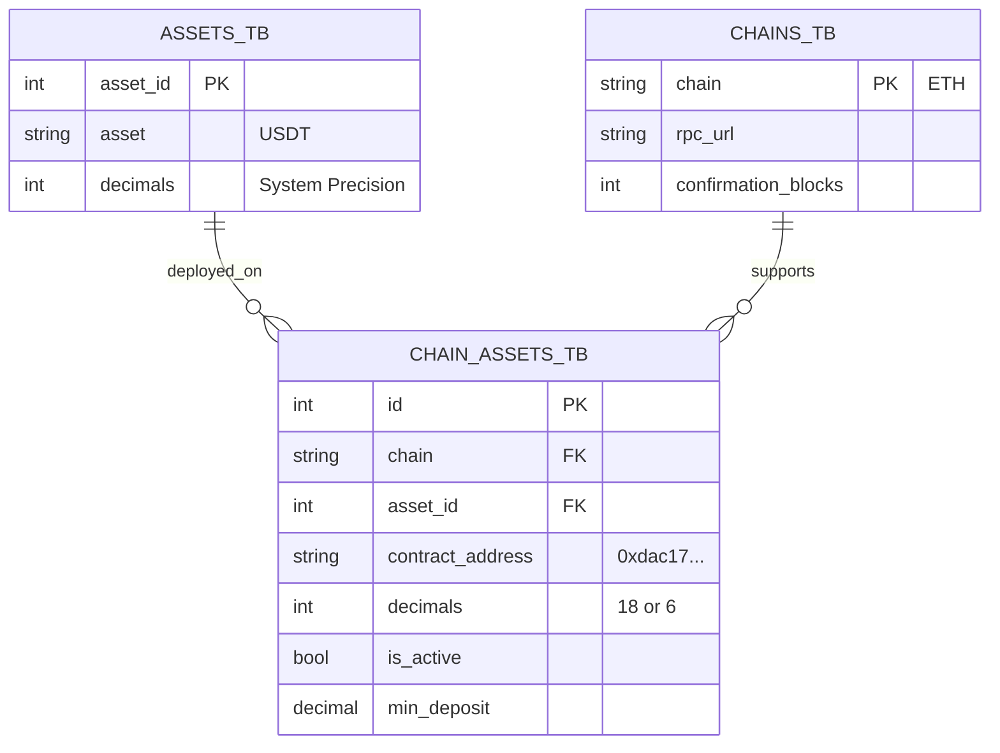

# ADR-004: Chain Asset Binding & Configuration Driven Workflow

**Date**: 2025-12-30
**Status**: Proposed
**Context**: Phase 0x11-b Sentinel Hardening

## 1. Problem Definition
Currently, the exchange has a logical definition of Assets (`assets_tb` defining "USDT", "BTC") but lacks a physical binding to blockchains. 
- **The Gap**: The system knows "USDT" exists, but doesn't know that "USDT" on Ethereum is contract `0xdac17...`.
- **The Consequence**: Sentinel scanners must seemingly "hardcode" these addresses or contracts, which is brittle, insecure, and requires code deploys to list new tokens.
- **The Goal**: Enable a "Configuration-Driven" listing process where Operations can list a new token via Admin Panel, and Sentinel automatically picks it up without restart/redeploy.

## 2. Solution Architecture

### 2.1 Database Schema (The Binding Layer)
We introduce an intermediate layer `chain_assets_tb` to bind logical Assets to physical Chains.



#### DDL Specification

**1. `chains_tb` (Chain Configuration)**
Stores network-level configuration to avoid hardcoding RPCs and safety parameters.
```sql
CREATE TABLE chains_tb (
    chain_id VARCHAR(32) PRIMARY KEY,  -- 'BTC', 'ETH', 'TRX'
    chain_name VARCHAR(64) NOT NULL,   -- 'Bitcoin Mainnet'
    rpc_urls TEXT[] NOT NULL,          -- Array of endpoints for failover
    network_id VARCHAR(32),            -- '1' (ETH), 'bitcoin' (BTC)
    scan_start_height BIGINT NOT NULL DEFAULT 0,
    confirmation_blocks INT NOT NULL DEFAULT 1,
    is_active BOOLEAN DEFAULT TRUE,
    created_at TIMESTAMPTZ DEFAULT NOW(),
    updated_at TIMESTAMPTZ DEFAULT NOW()
);
```

**2. `chain_assets_tb` (The Binding)**
Binds a logical asset to a specific chain implementation.
```sql
CREATE TABLE chain_assets_tb (
    id SERIAL PRIMARY KEY,
    chain_id VARCHAR(32) NOT NULL REFERENCES chains_tb(chain_id),
    asset_id INT NOT NULL REFERENCES assets_tb(asset_id),
    
    -- Technical Binding
    contract_address VARCHAR(128),  -- NULL for Native (ETH, BTC)
    decimals SMALLINT NOT NULL,     -- Chain-specific decimals (e.g. USDT-ERC20=6)
    
    -- Business Rules
    min_deposit DECIMAL(30, 8) DEFAULT 0,
    min_withdraw DECIMAL(30, 8) DEFAULT 0,
    withdraw_fee DECIMAL(30, 8) DEFAULT 0,
    
    -- Operational Status
    is_active BOOLEAN DEFAULT TRUE,
    created_at TIMESTAMPTZ DEFAULT NOW(),
    updated_at TIMESTAMPTZ DEFAULT NOW(),

    -- Constraints
    UNIQUE(chain_id, asset_id),        -- An asset appears once per chain
    UNIQUE(chain_id, contract_address) -- A contract maps to one asset
);
```

### 2.2 Operational Workflow (SOP)

#### Step 1: Listing (Admin Panel) - Enhanced Safety
1.  **Ops** creates logical asset "USDT" in `assets_tb`.
2.  **Ops** initiates "Bind Chain Asset":
    *   **Select Chain**: `ETH` (Must be selected first to define context)
    *   **Input Contract**: `0xdac17...`
    *   *(Note: Chain + Contract is the unique identifier)*
3.  **Auto-Verification (Admin Backend)**:
    *   Admin calls `eth_call(contract, "decimals()")` and `symbol()`.
    *   **IF** call fails -> Reject (Invalid Contract).
    *   **IF** success -> Auto-fill `decimals` (e.g. 6).
4.  **Confirm & Save**: Ops reviews the fetched data and confirms save to `chain_assets_tb`.

#### Step 2: Hot Reload (Sentinel)
Sentinel needs to know about this new config without a restart.

**Mechanism: Periodic Sync + Signal**
1.  **Polling**: `ChainScanner` trait adds a method `refresh_config(&mut self)`.
2.  **Implementation**:
    *   Every 60 seconds (configurable), Sentinel queries `chains_tb` and `chain_assets_tb`.
    *   Diff the active configuration.
    *   If `USDT` is added to `ETH` scanner:
        *   Add `0xdac17...` to the `LogFilter` topics or address list.
        *   Re-instantiate the filter for the *next* block scan.
    *   (Optimization): Use a shared `RwLock<Config>` that is auto-updated in background.

#### Step 3: Scanning
`EthScanner` loop:
```rust
loop {
    // 1. Hot Reload Check
    if time_to_refresh() {
        self.reload_watched_contracts().await?;
    }

    // 2. Scan
    let logs = eth.get_logs(filter).await?;
    for log in logs {
        // Match log.address against loaded config
        if let Some(asset_info) = self.config.get_asset_by_contract(log.address) {
            // Process Deposit
        }
    }
}
```

## 3. Decision Drivers
*   **Safety**: Decoupling logic from config reduces code changes and regression risks.
*   **Speed**: Listing new assets takes minutes (config) vs days (code deploy).
*   **Consistency**: Single source of truth (DB) for both Frontend (Display) and Backend (Scanning).

## 4. Migration Plan
1.  Create migration `012_chain_assets.sql`.
2.  Insert seed data for existing hardcoded mock assets (BTC, ETH, MockUSDT).
3.  Refactor `BtcScanner` and `EthScanner` to load strict config from DB instead of `config.yaml` or hardcoded constants.

## 5. Status
Accepted
