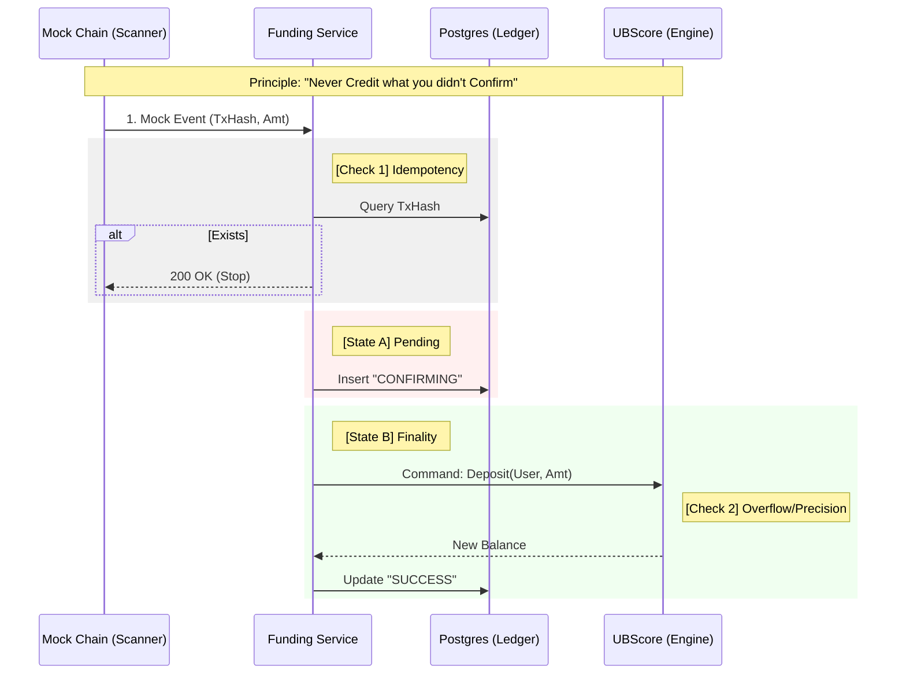
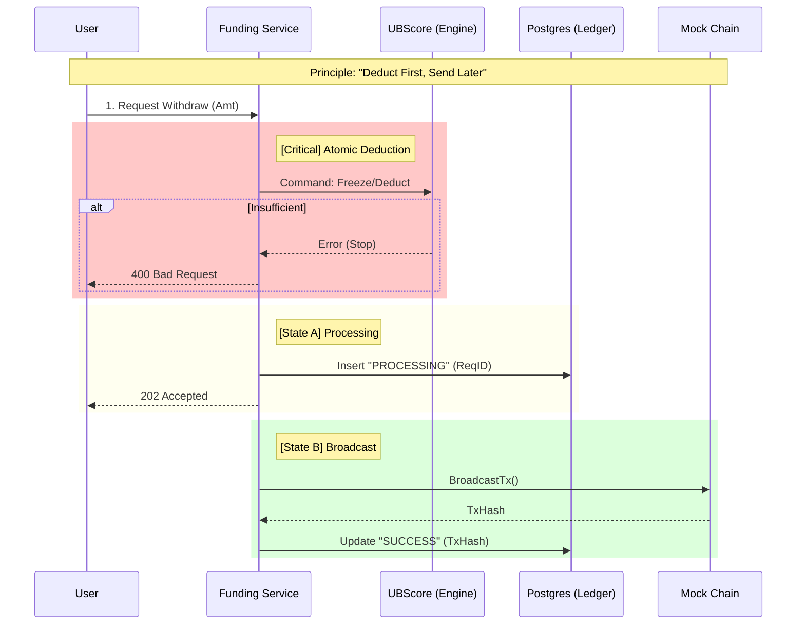

# 0x11 Master QA Strategy: Deposit & Withdraw (First Principles)

> **Role**: Agent Leader (Editor)
> **Context**: Phase 0x11 Release
> **Principle**: "Trust Nothing. Verify Everything."

This document establishes the **Unified Truth** for Quality Assurance. It transcends individual agent tasks to ensure the **Holistic Integrity** of the Financial System.

---

## 1. The Data Flow (The Lifecycle of Money)

We must verify not just "endpoints", but the **State Transitions** of assets as they flow through the system.

### 1.1 Deposit Flow: "The Inflow"
**Source**: External Chain (Mock) -> **Sink**: User Balance (UBScore)

**qa_focus**:
*   **Gap Analysis**: What happens if the process dies between State A and State B?
*   **Verification**: `test_deposit_withdraw_core.py` covers the happy path. `test_funding_idempotency.py` covers the "Exists" retry logic.

### 1.2 Withdraw Flow: "The Outflow"
**Source**: User Request -> **Sink**: External Chain (Mock)

**qa_focus**:
*   **Race Condition**: Can User send 2 requests simultaneously to bypass the Atomic Deduction? (Agent A Verified).
*   **Stuck State**: What if Broadcast fails? Balance is deducted but user gets nothing. (Manual Review / Ops Audit).

---

## 2. Verification Matrix (The "Coverage Map")

The Agents (A, B, C) must cover these specific vectors.

| Vector | Description | Owner | Script | Status |
| :--- | :--- | :--- | :--- | :--- |
| **Persistence** | Generated addresses must never change for a user. | Agent B | `core.py` | ✅ Planned |
| **Precision** | 8 decimal places (SATs) must be preserved perfectly. | Agent B | `core.py` | ✅ Planned |
| **Idempotency** | Replaying a Deposit event 100x must result in exactly 1 credit. | Agent A | `idempotency.py` | ✅ Planned |
| **Concurrency** | Parallel withdrawals > Balance must fail for N-1 requests. | Agent A | `idempotency.py` | ✅ Planned |
| **Isolation** | User A cannot query/guess User B's address or history. | Agent C | `security.py` | ✅ Planned |
| **Sanitization** | Negative numbers, SQLi strings, NaN must be rejected. | Agent C | `security.py` | ✅ Planned |
| **Integration** | DB Records must match Engine Balance State (Double Entry). | Agent B | `core.py` | ✅ Planned |

---

## 3. Strict Delivery Checklist (Definition of Done)

To sign off on **Phase 0x11**, the following conditions must be met **WITHOUT EXCEPTION**.

### 3.1 Functional Integrity
- [ ] **Zero Float**: `User Balance Delta` == `Withdraw Amount` (No phantom fees).
- [ ] **History Accuracy**: `GET /history` returns the exact logic record of the transaction.
- [ ] **Address Permanence**: A user gets the same Deposit Address across server restarts.

### 3.2 Security Barriers
- [ ] **No Negative Balances**: DB Constraints or Engine logic prevents `balance < 0`.
- [ ] **No Cross-User Leak**: 403 Forbidden for cross-access.
- [ ] **Internal-Only Mocks**: The "Mock Deposit" API is reachable, but marked for Dev/CI env only (or secured).

### 3.3 Reliability
- [ ] **Crash Resilience**: If Service crashes after "Deduct" but before "Broadcast", the record exists in DB as "PROCESSING" (Recoverable).
- [ ] **Test Suite Pass**: `verify_0x11_release.sh` returns Exit Code 0.

---

## 4. Next Steps for QA Team

1.  **Leader**: Review this document with Architect.
2.  **Agent A/B/C**: Execute your assigned scripts against the "Baseline" (expect failure).
3.  **Dev**: Implement based on `docs/src/0x11-deposit-withdraw.md`.
4.  **All**: Re-run verify scripts until GREEN.
