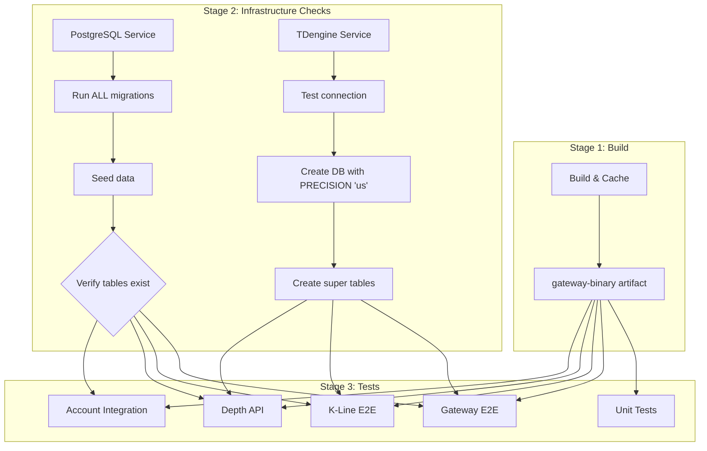

# CI Infrastructure Dependencies

## 第一性原理：每个测试的前置条件



## 关键前置条件清单

### PostgreSQL 前置条件
| 检查项 | 验证方法 | 失败后果 |
|--------|----------|----------|
| 连接可用 | `pg_isready` | 所有 PG 测试失败 |
| 用户存在 | 用 `trading` 登录 | "role does not exist" |
| 数据库存在 | `\c exchange_info_db` | "database does not exist" |
| 001_init_schema.sql 执行 | `\dt` 查看表 | "relation does not exist" |
| 002_create_api_keys.sql 执行 | `\dt api_keys_tb` | API 认证失败 |
| 003_internal_transfer.sql 执行 | `\d balances_tb` 看 account_type | 转账功能失败 |
| 004_fsm_transfers.sql 执行 | `\dt transfers_tb` | 转账记录失败 |
| seed_data.sql 执行 | `SELECT * FROM users_tb` | 测试数据缺失 |
| balances_tb 存在 | `\dt balances_tb` | 余额查询失败 |

### TDengine 前置条件
| 检查项 | 验证方法 | 失败后果 |
|--------|----------|----------|
| 连接可用 (port 6041) | `curl localhost:6041/rest/login/root/taosdata` | 所有 TD 测试失败 |
| Database 存在 | `SHOW DATABASES` | "Database not exist" |
| **精度为 'us'** | `SHOW CREATE DATABASE trading` | **"Timestamp data out of range"** |
| Super tables 存在 | `SHOW STABLES` | "Table does not exist" |
| - orders | `DESCRIBE orders` | 订单写入失败 |
| - trades | `DESCRIBE trades` | 成交写入失败 |
| - balances | `DESCRIBE balances` | 余额快照失败 |
| - klines | `DESCRIBE klines` | K线聚合失败 |

### Gateway 前置条件
| 检查项 | 验证方法 | 失败后果 |
|--------|----------|----------|
| Binary 可执行 | `chmod +x && ./target/release/zero_x_infinity --help` | 启动失败 |
| 动态链接库存在 | `ldd` 检查 | 运行时 crash |
| Config 正确 | `--env ci` 加载 `config/ci.yaml` | 连接错误的端口 |
| Port 8080 可用 | `lsof -i :8080` | 端口冲突 |

## 当前 CI 问题根因

```
问题：stale database with wrong precision
  ↓
ci_clean.py DROP DATABASE
  ↓
只创建空数据库，没有表
  ↓
Gateway 启动前测试脚本查询
  ↓
"Table does not exist"
```

## 正确的 CI 流程

```
1. check-postgres job:
   ✓ Run ALL migrations (for f in migrations/*.sql)
   ✓ Run seed_data.sql
   ✓ Verify ALL tables exist
   
2. check-tdengine job:
   ✓ Verify connection
   ✓ CREATE DATABASE IF NOT EXISTS trading PRECISION 'us'
   ✓ Check precision is correct
   ✓ CREATE super tables (orders, trades, balances, klines)
   
3. Integration test jobs:
   ✓ Depend on check-postgres AND check-tdengine
   ✓ ci_clean.py only DELETE data, not DROP database
   ✓ Gateway init_schema is idempotent (IF NOT EXISTS)
   ✓ Tests run
```

## 遗留问题

1. **TDengine 表创建时机**：Gateway 的 `init_schema` 在 Gateway 启动时才运行
   - 如果测试脚本在 Gateway 启动前查询 TDengine，会失败
   - **解决方案**：在 check-tdengine job 里也创建 super tables

2. **精度不一致**：如果 database 已存在但精度错误
   - `CREATE DATABASE IF NOT EXISTS` 不会修改已存在的 database
   - **解决方案**：检查精度，如果错误则 DROP + CREATE
